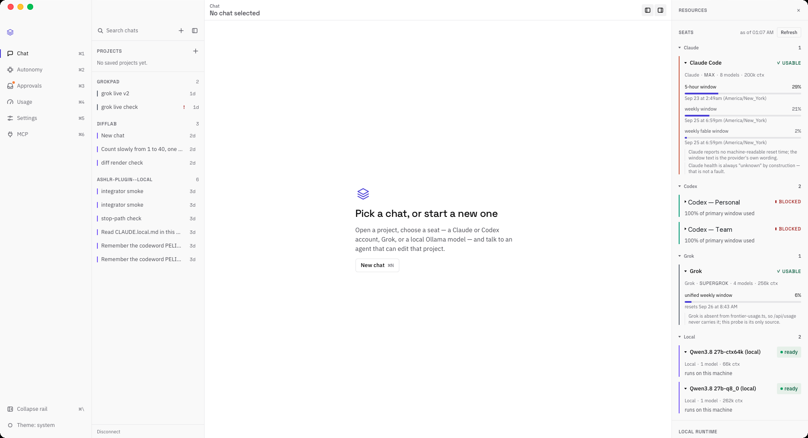

<a id="ashlr-universe"></a>

# Ashlr Verse

**One console for every coding agent you run: your subscriptions, your local models, Claude cloud sessions and a fleet that merges only inside a scope you sign.**

**[verse.ashlr.ai](https://verse.ashlr.ai)**




[](https://www.npmjs.com/package/@ashlr/hub)
[](https://www.npmjs.com/package/@ashlr/hub)
[](./LICENSE)
[](https://nodejs.org)

---

## What it is

**Ashlr Verse** is an operator console for coding agents. Every Claude, Codex
and Grok account you own becomes a *seat*, and so does every tool-capable local
model. You chat with any of them in one workbench. You watch and bound an
autonomous fleet that works your enrolled repositories. And you hand work to
Claude Code cloud sessions that keep running on your Claude credits after the
subscription window is spent.

It ships as a macOS desktop app and as the `ashlr` CLI (`@ashlr/hub`), which
serves the same console in a browser on macOS, Linux and Windows. Under the
console is the Hub kernel: the CLI, the Universe experiment runtime and
account-aware resource pools.

Names stay compatible. The repository is `ashlr-hub`, the package is
`@ashlr/hub`, the command is `ashlr`, and experiments remain `ashlr universe`
with the `@ashlr/hub/universe` SDK. "Ashlrverse" is the wider project; existing
manifests, schemas and stores need no naming migration.

The user guide is [`docs/VERSE.md`](https://github.com/ashlrai/ashlr-hub/blob/master/docs/VERSE.md).

---

## The desktop app (macOS)

The desktop app is a native window around Verse, with a menu-bar item,
notifications while it is hidden, a Dock badge for Needs-you items and the
Terminal pane in the chat dock. It bundles the `ashlr` CLI, so it needs no
separate Node.js install to run.

### Install

There is no public installer and the build is unsigned. You build it once on
your Mac and keep it in the Dock. The full sequence, prerequisites (Rust with
`tauri-cli` 2, Bun, Node, Xcode command line tools) and the checks that the
bundle carries the current assets are in
[Desktop app](https://github.com/ashlrai/ashlr-hub/blob/master/docs/VERSE.md#desktop-app-macos).
In short, from the repository root:

```sh
npm ci
npm run build:binary                       # the CLI as one executable, web assets included
node desktop/scripts/prepare-sidecar.mjs   # stage it inside the app
cd desktop && npm run icons && CI=true cargo tauri build
rm -rf /Applications/Ashlr.app
cp -R src-tauri/target/release/bundle/macos/Ashlr.app /Applications/
```

Run all of those steps every time. A bare `cargo tauri build` wraps a new shell
around whatever web assets an earlier build left behind.

### Open

The first time, right-click `Ashlr.app` and choose **Open**, because the build is
unsigned. After that it opens normally. A small launch window says what is
happening while the bundled server starts on `127.0.0.1:7777`. The Verse window
then opens with its tokens already handed over, so there is nothing to paste.
Closing the window hides it to the menu bar; **Quit** stops the server.

On first launch a two-minute tour shows which seats this Mac can use, whether
there is a local model, and the three ways to stop things.

### Sign in your seats

A seat is one account and the CLI that drives it, pinned to its own profile so a
turn can never land on the wrong account. Verse never asks for or stores a
credential; each vendor CLI signs itself in.

1. **Prepare a private profile** for each account. For the Claude seat the cloud
   lane uses:

   ```sh
   ashlr resources profile prepare --provider claude \
     --directory ~/.ashlr/native-profiles/claude-a \
     --executable /absolute/path/to/the/claude/binary --json
   ```

   Use `--provider codex` or `--provider grok` for those accounts, with a new
   directory each time. Nothing is signed in yet.
2. **Sign in** with the `loginCommand` the command printed: `auth login
   --claudeai` for Claude, `login` for Codex, `--no-auto-update login --oauth`
   for Grok. Finish the vendor's browser flow as the intended account.
3. **List the account** in `~/.ashlr/account-connections/connections.json`,
   using the `command` from step 1:

   ```json
   {
     "schemaVersion": 1,
     "intervalMs": 30000,
     "accounts": [
       { "id": "claude-a", "label": "Claude Max", "provider": "claude",
         "command": ["/absolute/node", "/Users/you/.ashlr/native-profiles/claude-a/launcher.mjs"] }
     ]
   }
   ```

4. **Reopen Verse.** The account appears as a seat in the composer and in
   **Apps & Accounts**, which shows its health, windows and resets. A background
   sweep checks every seat every 10 minutes with status commands only.
   **Reconnect** opens the seat's own login in Terminal.

Local models need no sign-in. If Ollama is running, every tag that supports tool
use becomes a local seat. The account commissioning details, including how to
check identity and quota, are in
[Resource Pools](docs/RESOURCE-POOLS.md#commission-native-accounts-and-local-capacity).

---

## The CLI

The same console runs from the CLI on macOS, Linux and Windows. It needs Node.js
22.15 or newer and Git.

```sh
npm install -g @ashlr/hub
ashlr --version
ashlr verse                 # start the server and open http://127.0.0.1:7777/verse/
```

`ashlr verse` prints two tokens. Paste the **read token** into the page once. It
asks for the **mutation token** the first time you start a chat or change
something. The server listens on `127.0.0.1` only, and neither token is written
to disk. `ashlr verse --no-open --json` prints one machine-readable line instead
of the banner.

What differs from the desktop app: the chat dock's Terminal pane needs the
desktop app's runtime (the browser gets **Open in Terminal.app** instead), and
the custody helper behind autonomy is macOS-only (a Secure Enclave key and Touch
ID).

---

## Quickstart

1. **Install** the desktop app or the CLI (above), and open Verse.
2. **Sign in your seats** (above). Start `ollama serve` for local seats.
3. **Open a project.** **New chat** (⌘N) picks a seat and a folder; in the
   desktop app **Choose folder…** opens the native picker. Saving a folder as a
   project never enrolls it for unattended work.
4. **Chat.** The composer takes attachments, `@` files and `/` commands, and
   queues up to 3 turns while one runs. The context meter shows the model's real
   window and compaction point; **Continue in a fresh chat** hands off with a
   note built without a model call. ⌘K reaches every chat, action and seat; ⌘J
   opens Needs you.
5. **Optionally run the local fast lane.** `ashlr local-runtime start --slots 4`
   starts llama-server with batching slots, and
   `ASHLR_VERSE_LOCAL_DISPATCH=llama-server` in Verse's environment sends local
   turns to it. Model discovery stays on Ollama.
6. **Optionally hand work to the cloud.** **New cloud task** on Command, or
   `ashlr cloud launch "<task>" --repo owner/name` ([cloud lane](#the-cloud-lane)).
7. **Inspect autonomy preparation** with `ashlr authority setup --dry-run --json`
   and `ashlr authority status`. Guided setup can prepare prerequisites after
   your explicit actions; once your standing grant is active,
   `ashlr authority resident start` runs the resident fleet under it.

---

## Autonomy commissioning path

**Current release status:** `ashlr authority setup` is a resumable preparation
workflow. Its dry run is read-only; a live run can create custody, GitHub and
grant state after your explicit actions. Setup itself never installs or restarts
the daemon. The legacy service paths (`ashlr daemon install`, `ashlr setup`,
`worker setup`, `update`) remain temporarily unavailable for install, reinstall, repair and restart and support status and uninstall only; the permit-based compiled daemon and conductor trust roots are empty.
The resident runtime instead runs under your **standing grant**
([docs/RESIDENT-RUNTIME.md](docs/RESIDENT-RUNTIME.md)): with a Touch-ID-signed
grant active, `ashlr authority resident start`, typed by you in your own
terminal, installs `ai.ashlr.daemon` from a clean release with its plist
regenerated from config. Every tick re-verifies the grant, Stop and the switch.

Autonomy ships **dormant**: nothing runs until your custody key is compiled in,
you sign a grant, and you start the resident service yourself.

```sh
ashlr authority setup --dry-run   # print every step and what it would do
ashlr authority setup --dry-run --json  # machine-readable checklist and runtime block
# ashlr authority setup           # live preparatory steps require your explicit actions
ashlr authority status            # grant, switch, Stop, rollout stage, ledger, custody
```

`setup` performs each available step and pauses for the steps marked ✋. Its
last step reports the resident runtime: in place, waiting on the exact command,
or blocked on a missing prerequisite. Rerunning it is safe: whatever is already
in place is reported `already` and left alone (the provenance key is rotated
only once). Verse shows the same checklist, with the next step's command to
copy.

1. ✋ **Install the custody helper:** `sudo scripts/install-custody.sh`
   (root-owned, in `/usr/local/libexec/`).
2. ✋ **Create the Secure Enclave key** (Touch ID). The private key never leaves
   this Mac's Secure Enclave.
3. ✋ **Compile the public key in.** Setup opens a PR adding it to
   `src/core/authority/trust-roots.ts`. You merge it, run `npm run build`,
   install the release as usual and restart the daemon.
4. ✋ **Create the `ashlr-fleet` GitHub App** (one browser page) and **install
   it** on the enrolled repos (one more click). Its private key goes straight
   into the custody Keychain item; the PEM never touches disk.
5. ✋ **Store a Claude token:** run `claude setup-token` and paste it when
   asked. Only tool-less judge and Leader calls ever see it.
6. **Apply the rulesets** (`ashlr authority protect --print`, then `--apply`):
   required checks, no force-push or deletion, and bypass for your admin role
   but never for the App.
7. **Create the canary** repository `fleet-canary` with its CI workflow, using
   your own `gh` login (the App cannot write workflows).
8. ✋ **Retire the old key.** Confirm moving `~/.ashlr/activation/` out of
   `~/.ashlr`; archive it offline, then delete it.
9. **Rotate the provenance HMAC key** (`ashlr authority rotate-provenance`).
10. ✋ **Sign the first grant** (Touch ID) and, optionally, set the switch to
    Autonomous. The grant starts on the shadow stage of its rollout ladder.
11. ✋ **Start the resident daemon** in your own terminal:
    `ashlr authority resident start`. It refuses agents, a dirty build, Stop,
    the switch at Off and an inactive grant, shows the release, plist and daily
    budget, and asks you to confirm. `ashlr authority resident status` shows
    drift after a config change; `ashlr authority resident stop` removes the
    service.

Standing grants require Touch ID reapproval every 30 days or after authority
code changes; until then the resident daemon parks without working.

**What a grant allows.** A standing grant names the repositories, engines, risk
and size caps, spend ceiling and Leader classes, and is valid for at most 30
days. Effective policy is the minimum of the grant, the config and compiled
ceilings (medium risk, 10 files / 300 lines, 24 merges per repo per day).
Lowering never asks: the switch (Off, Propose, Autonomous) goes down instantly,
**Stop** writes `~/.ashlr/KILL`, and **Revoke** needs a new grant to resume.
Every merge happens on GitHub, pinned to the head SHA, after the gates and a
judge from a different model family. CI and a fresh re-run watch it for two
hours, and a red merge is reverted automatically. The full model is in
[`docs/STANDING-AUTHORITY.md`](https://github.com/ashlrai/ashlr-hub/blob/master/docs/STANDING-AUTHORITY.md).

**Budget modes** decide how much of each seat autonomy may use. They are set in
`~/.ashlr/budget.json` and from the budget pill on Command. Under **balanced**
(the default), Claude keeps 40 % of its weekly window for you, and autonomy
never uses it while its five-hour window is above 70 %. Grok keeps no reserve.
Local models are free and unlimited. **all-in** drops the reserves, and
**reserve** keeps 85 % of every paid window for you. Codex is off for autonomy
until you switch it on. A seat whose usage cannot be read is never eligible.
Your own chats ignore reserves.

---

## Resources, on every page

Press **⌘.** (or click the tab on the right edge, or run "Open Resources" from ⌘K) to open the Resources drawer:
every Claude, Codex and Grok account with its live 5-hour and weekly windows, the share kept for you, reset times
and Reconnect / Check again; your local models with runtime state and context windows; and your cloud credits.
It opens over your work or pins as a column beside it, and a dot on the edge tab tells you at a glance whether
everything is usable.

Without opening anything, the **resource bar** in the rail foot keeps every resource in view. It shows one battery
per account with how much of its window is left, plus your local models and your cloud credits. Each row carries
the provider's own mark: Anthropic's Claude, OpenAI, xAI's Grok or Ollama. Hover a row for every window, its reset
and the share kept for you, or click it to open the drawer. **Hide resource bar** is in the drawer's footer and in
⌘K.

## Working on Verse itself

```sh
npm run gate          # minutes, not half an hour: static checks + the tests your change can reach
npm run ship:local    # build, install as your CLI, update Ashlr.app (--native: shell + icon), restart, verify
```

Then `npm publish` the tarball `ship:local` prints. `npm run gate:full` runs every suite. See
[`docs/RELEASING-LOCALLY.md`](https://github.com/ashlrai/ashlr-hub/blob/master/docs/RELEASING-LOCALLY.md).

## The cloud lane

New in 3.11. Verse can start **Claude Code cloud sessions** (claude.ai/code) and
track what they deliver. They run on your Claude account, including its cloud
credits, so they keep working after the subscription window is spent.

- **Start one** from Command (**New cloud task**), from a chat (**Run in cloud**
  in the composer's ⋯ sheet), or with `ashlr cloud launch "<task>"`. Verse can
  also work through its own improvement backlog: **Improve Verse** launches the
  next item now, and with self-improvement on the server launches at most 4 a
  day on its own.
- **Each task is instructed to deliver to GitHub.** Verse cannot read a session
  back, so it asks the session to push `ashlr-cloud/<taskId>` and open a **draft**
  PR with a report block. Verse follows a matching PR with `gh` and lists it in
  Needs you when open. Failed launches and missing PRs remain separate states.
  **Nothing in the lane merges.**
- **Spend is an estimate, and is labelled as one.** Claude does not expose the
  credit balance. Verse counts $3 per launched session against $250 by default,
  and you correct it after checking
  [claude.ai/settings/usage](https://claude.ai/settings/usage). Limits: 4 at
  once, 20 a day, and self-improvement stops at a $40 reserve.
- **It launches only as the `claude-a` seat**, signed in with a claude.ai
  account. Cloud sessions refuse API keys.
- **Turn it off:** `ashlr cloud budget --self-improve off` stops launches Verse
  starts itself, and `ASHLR_CLOUD_AUTO=0` stops the background scheduler.

How it works, the delivery contract, the budget math and every failure code:
[`docs/CLOUD.md`](https://github.com/ashlrai/ashlr-hub/blob/master/docs/CLOUD.md).

---

## Reference

The sections below document the Hub underneath the console: the Universe
experiment kernel, resource pools, and the legacy enrolled-repository fleet with
its dashboard and CLI.

### Universe experiments

Universe turns a pinned Git seed, an objective and a resource budget into
competing, evaluated artifacts. It runs isolated variants, freezes their
artifacts, evaluates them against a fixed comparator, keeps the best result in
each niche, and reuses those winners as parents in later generations. Its
[North Star](docs/NORTH-STAR.md) is useful accepted engineering changes per token
and hour, not more generated code.

Start with the [executable demo](docs/DEMO.md): two generations, three competing
variants, seven correctness cases, two retained niches and a deliberately broken
candidate that must lose. It runs real code without a model account. The
candidate transformations are scripted, so it demonstrates the mechanism, not AI
productivity.


Recorded deterministic fixture at source `914ebd1f566c0dc4f0a95479d9c4f464289e736e`.
Arrows show parent reuse; byte reductions are not measured AI engineering yield.
Read the [demo evidence and reproduction guide](docs/DEMO.md#recorded-example).

From a trusted checkout on **macOS with Node.js 24+ and Git**:

```sh
npm ci
npm run build
ASHLR_DEMO_ROOT="$(mktemp -d /private/tmp/ashlr-universe-demo.XXXXXX)"
node bin/ashlr universe demo --root "$ASHLR_DEMO_ROOT" --json
node bin/ashlr universe console --root "$ASHLR_DEMO_ROOT"
```

Open the printed loopback URL and enter its private read token to inspect
trials, parents and the evidence graph. The console observes; it does not launch
work. See the [demo guide](docs/DEMO.md) for expected results and recovery.

| Build your next step | Guide |
|---------------------|-------|
| Understand the demo and its evidence | [Demo walkthrough](docs/DEMO.md) |
| Configure your own experiments and campaigns | [Ashlrverse operator guide](docs/ASHLR-UNIVERSE.md) |
| Connect native/local workers and budget their usage | [Resource Pools](docs/RESOURCE-POOLS.md) |
| Run a verified package independently of this checkout | [Pinned local runtime](docs/ASHLR-UNIVERSE.md#install-a-pinned-local-runtime) |
| Understand the components or contribute | [Architecture](docs/ARCHITECTURE.md#current-runtime-map) · [Documentation map](docs/README.md) |

### Resource pools

For explicitly enrolled account and local-model tasks, the
[resource pool runner](docs/RESOURCE-POOLS.md) combines quota windows, rolling
task caps and shared-account concurrency before dispatch. `ashlr resources pool`
records assignments and reported usage without switching credentials or starting
a daemon. It is separate from Universe's evaluator.

`ashlr resources pool console` opens its
[operations desk](docs/RESOURCE-POOLS.md#operate-the-resource-console): account
capacity lanes, routing exclusions, dispatch activity and token evidence. Adding
`--execute --workspace /absolute/worktree` enables a durable foreground queue with
task submission, pause/resume, cancellation and session-local output.

### The legacy enrolled-repository fleet

ashlr-hub also contains the original autonomous fleet for enrolled repositories.
In the current production build its compiled daemon and conductor trust roots are
empty, so live non-dry fleet execution is dormant unless a standing grant (above)
admits the tick; verified dry-run, status and local-console paths remain
available.

When admitted, the fleet scans your backlog, dispatches sandboxed agent swarms
across multiple backends (local Ollama/LM Studio, Claude Code, Codex, any
OpenAI-compatible API), and deposits proposed diffs into an **Approval Inbox**.
Without a grant, nothing touches a branch until you explicitly approve it. The
kill-switch is a single file.

It is also a local harness: one CLI and web dashboard that indexes your enrolled
projects, aggregates your MCP servers into a single gateway, tracks real spend,
and provides `ashlr run` / `ashlr swarm` for ad-hoc work.

### Authority defaults

Without a standing grant, first activation stops at observation: run
`ashlr preflight`, enroll a repo, and complete a dry-run. Empty compiled trust
roots refuse live non-dry daemon and conductor effects, and resident service
mutation has no production authority. No dry-run or readiness result widens
runtime authority.

| Path | Default | Required authority | Possible outward effect |
|------|---------|--------------------|-------------------------|
| Daemon generation | **Dormant in production** | A signed standing grant (`ashlr authority setup`) or a separately provisioned compiled trust root; the shipped roots are empty | Dry-run/status only; live non-dry dispatch refuses before effects |
| Standing-grant merge | **Off until setup** | A Touch ID-signed grant, the merge gates and a cross-family judge | Merge on GitHub pinned to the head SHA, watched for two hours and reverted if red |
| Inbox apply | Manual | Explicit `ashlr inbox approve`, confirmation, enrollment, kill-switch clear | Applies to a dedicated local branch; never silently edits the working tree |
| Protected PR submit | Operator-invoked | Explicit `ashlr inbox submit`, caller confirmation, signed frontier provenance, fresh verification, and live protected-remote evidence | Opens one review PR; never merges `main` or contacts a model. `--yes` is caller intent, not an authenticated human receipt. |
| Legacy autonomous merge | **Off** | `foundry.autoMerge.enabled: true` plus the selected tier, judge-backed verification, or evidence authority gates | Local merge or protected remote PR, depending on policy; every refusal is fail-closed |
| Judge-free evidence merge | **Off** | Base- and diff-bound deterministic verification, signed provenance/evidence, strict scope/risk policy, and live protected-branch checks | Protected remote PR handoff only; no local fallback, self-target merge, partial capture, or build/CI/manifest change |
| Cloud task | Operator-invoked, or self-improvement under its budget | The cloud budget gates and a signed-in `claude-a` seat | A draft PR on `ashlr-cloud/<taskId>`; never merges |
| Deploy | Never performed by the daemon | Explicit `ashlr ship --deploy <target> --confirm` after pre-ship checks | Runs the selected production deploy command |
| OS service mutation | **Temporarily unavailable** on legacy paths | No install/reinstall/repair/restart authority on `daemon install` / `setup` / `update`; the resident service installs only through `ashlr authority resident start` under an active standing grant | Legacy paths expose status and uninstall only; `resident start` installs `ai.ashlr.daemon` after your confirmation |

No successful test, model verdict, or proposal record grants deployment or service-install authority. Those are separate operator commands.

---

## The legacy autonomous loop

Most AI coding tools are request-response: you ask, the model answers. Ashlr's source architecture defines a **continuous autonomous loop**. Without a signed standing grant, the current production entrypoints keep its non-dry daemon and conductor effects dormant because their compiled trust roots are empty:

```
End-State Spec (your vision)
  → Leader (budget-gated planning tick: memos, goals, vetoable actions)
    → Goals + milestone planner (concrete ordered work)
      → Fleet supervisor (24/7 dispatch to enrolled repos)
        → Backend router (routes each item to the right engine by tier)
          → Sandboxed swarm (throwaway worktree, push severed, diff-only capture)
            → Manager judge or deterministic evidence gate (policy-selected)
              → Merge authority gate (default off; protected PR required in evidence mode)
                → Approval Inbox (default human gate)
                  → Comms channel (Telegram/iMessage for approve-by-text)
                    → Scorecard feedback (outcomes feed learned routing)
```

**What this architecture unlocks once a standing grant or an independently provisioned runtime admits it:**

- The fleet works your backlog while you sleep.
- You review proposals with `ashlr inbox`, not a chat window.
- High-confidence work can optionally reach `main` without a manual approve, but only through an explicitly enabled authority mode and its deterministic gates. Evidence mode additionally requires a protected remote PR path. This is off by default.
- Adding a new backend (a NIM, a local Qwen, a different API) is one config entry, no code change.

**Legacy fleet properties:** The following policy describes the enrolled-repo
daemon/swarm path, not every Hub command. Universe and Resource Pools have
separate [execution boundaries](docs/ARCHITECTURE.md#current-runtime-map).

- **Preflight-first activation.** `ashlr preflight` verifies daemon readiness, backend connectivity, and key configuration before you enroll any repos. Run it once before your first enroll.
- **Proposal-only generation floor.** The daemon's generation path emits pending proposals and imports no apply, push, PR, or deploy primitive. Manual inbox approval and the separate default-off auto-merge subsystem are the only code-change authority paths.
- **Explicit merge authority.** In the default tier mode, local-model proposals stay proposals and allowlisted frontier producers can earn a gated path to `main`. Verification and evidence modes replace producer tier with stricter judge-backed or deterministic evidence authority. Every mode is default off and fail-closed.
- **Sandboxed by construction.** The legacy autonomous loop routes external engines through `runEngineSandboxed`: a throwaway git worktree with push credentials severed and scrubbed diff capture.
- **OS-level confinement.** Optionally wraps each run with `sandbox-exec` (macOS) or `bwrap`/`firejail` (Linux) — read-jailed to the worktree, network egress blocked.
- **Kill-switch.** `touch ~/.ashlr/KILL` gates legacy enrolled-repo mutations. Explicit Universe campaigns and Resource Pool sessions have their own cancellation controls; this is not a universal process kill command.
- **Small, explicit dependency boundary.** Core and CLI primarily use Node builtins; the package bundles MCP transport, Markdown parsing and archive handling through `@modelcontextprotocol/sdk`, `marked` and `tar`. Backends are CLIs or APIs you explicitly configure.
- **Self-improving.** The fleet can target its own source, but a self-authored diff is ineligible to merge unless the full invariant suite passes flag-off and flag-on, and any diff that weakens a safety test is refused by construction.

---

## Legacy fleet quickstart

For Universe experiments and the resource fleet map, follow the
[current-source quickstart](docs/QUICKSTART.md#run-the-current-universe-kernel).
It needs no provider account for the deterministic demonstration. Real workers
have a separate [commissioning procedure](docs/RESOURCE-POOLS.md#commission-native-accounts-and-local-capacity).

The instructions below cover the **general Hub and legacy fleet configuration**.
They do not install an unreleased source feature or activate the dormant daemon.

### Install from source

The npm install is [above](#the-cli). To run from a checkout instead:

```sh
git clone https://github.com/ashlrai/ashlr-hub
cd ashlr-hub
./install.sh   # builds dist/, symlinks bin/ashlr → ~/.local/bin/ashlr
```

`install.sh` requires Node 22.15+ and is idempotent — safe to re-run after pulling updates.

### 1. Confirm the setup boundary

```sh
ashlr setup  # currently refuses before config or wizard work
```

Setup currently refuses before loading config or running the wizard while install/reinstall/repair/restart authority is withheld. It returns nonzero and leaves setup state untouched. Existing services support `ashlr daemon service-status` and `ashlr daemon uninstall`; live one-shot and resident starts remain dormant because the production daemon trust roots are compiled empty. Service status reports registration as `present`, `absent`, or `unknown`; only proven absence permits an in-place update.

### 1a. Preflight check (optional but recommended)

```sh
ashlr preflight
```

Verifies daemon readiness, backend connectivity, and key configuration before you enroll any repos. Run it directly: `ashlr setup` does not reach these checks in the current release because it refuses before config or wizard work.

### 2. Enroll a repo

The fleet only works repos you have explicitly enrolled. Nothing is scanned until you add one.

```sh
ashlr enroll add ~/path/to/my-project
ashlr enroll list   # confirm enrollment
```

### 3. Dry run — see what would happen, spend nothing

```sh
ashlr daemon start --once --dry-run
```

Prints what the fleet would work on. Creates no proposals, spends $0.

### 4. Confirm the live boundary

```sh
ashlr daemon start --once
```

Without a signed standing grant, the current production build refuses this
non-dry command before dispatch or proposal creation because its compiled daemon
trust roots are empty. Use
`ashlr daemon status`, the dry-run above, and Mission Control for verified
observation. A test-only injected trust root is not production activation.

### 5. Review proposals

```sh
ashlr inbox                # list pending proposals
ashlr inbox show <id>      # inspect diff + metadata
ashlr inbox approve <id>   # apply to branch — confirm-gated, never silent
ashlr inbox submit <id>    # fresh verify + protected review PR — never merges main
ashlr inbox reject <id>    # discard a pending proposal; applies nothing
```

Changes applied through `ashlr inbox approve` land on a dedicated branch — never your working tree directly — so undoing one is ordinary git. Swarm-applied work has a first-class undo: `ashlr swarm rollback <id>` restores the repo to its pre-swarm git state (confirm-gated, never force-push).

That is the default loop. Nothing touched a branch until step 5. The Approval Inbox is the **default human gate**; only an explicitly enabled auto-merge policy can bypass manual approval, and it must still clear its configured deterministic authority and verification gates.

### Open Mission Control (optional)

```sh
ashlr serve           # web dashboard at http://127.0.0.1:7777 (localhost only)
ashlr serve --open    # also opens the browser
```

The dashboard shows fleet status, all runs and swarms, the inbox, rolling spend analytics, and shared memory. The new console is at `/next/`; `/` is the separately labelled legacy dashboard.

`ashlr serve` prints a fresh read token on every start. In `/next/`, paste it
into the **Read token** control once. The new console uses it only for the
`POST /api/session` exchange and then discards the raw read token. A 15-minute,
read-only HttpOnly cookie plus a random 256-bit client proof in
`sessionStorage` survives a page reload until the signed ticket expires. After
expiry, enter the raw read token again; `/next/` cannot silently renew because
it does not retain that token. EventSource sends only the non-authority proof
in its URL: it is useless without the matching signed HttpOnly ticket, and a
`no-referrer` policy keeps it from leaving the dashboard.

When `/next/` mutations are explicitly enabled, its separate mutation token is
held only in module memory for a 20-minute idle window. It is never written to
`sessionStorage`, local storage, a cookie, or a URL; **Lock** clears it
immediately. The legacy dashboard at `/` has a different, separately labelled
transport: it retains its raw read token in tab `sessionStorage` to renew the
cookie, and prompts independently for mutation authority rather than using the
new console's held-token contract.

Static assets and the minimal `{ "ok": true }` liveness response remain public
on loopback; every proprietary API read requires the read token or the ticket
plus its matching client proof.

Headless clients send the read token as a header:

```sh
curl -H "X-Ashlr-Token: $ASHLR_DASHBOARD_READ_TOKEN" \
  http://127.0.0.1:7777/api/snapshot
```

Read tokens and cookies cannot approve, dispatch, pause, resume, repair, or open
local paths. When mutations are explicitly enabled, the server prints a second,
independent mutation token. Both console contracts keep it out of persistent
browser storage, cookies, and URLs. Mutations accept only that token in
`X-Ashlr-Token`.

---

## Resident loop and owner-invoked goals

The source includes a resident goal conductor, but current production compiled
conductor trust roots are empty. The loop dry-run is available; live non-dry
loop commands below refuse before effects:

```sh
ashlr loop               # one tick — advances active goals, then backlog fallback
ashlr loop --watch       # continuous (Ctrl-C to stop)
ashlr loop --dry-run     # show what would advance, no proposals
```

`ashlr goal "<objective>"` is different: it is a live, owner-invoked,
proposal-only path that plans and advances one bounded milestone. It does not
grant resident or unattended conductor authority:

```sh
ashlr goal "harden the inbox apply path"
ashlr goals list                         # track progress
ashlr goals advance                      # execute the next milestone

# One owner-invoked, proposal-only attempt with a bounded machine-readable result.
# Run only in a disposable OS account or VM, in an independently rooted clone
# with no remotes, credential helpers, provider tokens, or shared Git common dir.
ashlr goal "add one regression test" --project /tmp/ashlr-disposable/repo --direct --json
```

`ashlr goal` rejects unknown, duplicate, missing-value, and conflicting options
instead of silently ignoring them; this is an intentional fail-fast contract.

The Leader and vision commands let you define and steer the high-level direction:

```sh
ashlr leader show         # latest Leader memo, its actions and hit-rate
ashlr leader tick         # apply due class-B actions, grade moves, run only if due
ashlr leader veto <id>    # undo one action (or --memo <id> for a whole memo)
ashlr vision show         # current end-state spec
ashlr vision review       # alias of `ashlr leader tick --wait` (no Strategist, no briefing)
ashlr vision preview      # read-only exact targets, dependencies, and holds
ashlr vision shadow       # authenticated receipt + zero-effect suggestion
ashlr vision approve      # explicit planning adoption: evolve spec + goals
ashlr vision reconcile    # create at most one dependency-ready goal
```

In 3.10 `ashlr vision review` no longer runs the legacy Strategist, which went
to the Claude CLI first with no budget gate. It runs the Leader tick, which
starts a run only when one is due and only on a seat the budget mode admits.
Preview, shadow, approve and reconcile still read the latest briefing already
on disk. The nightly job that ran the old review is replaced by the plist that
`ashlr leader oversight-plist --print` prints; you install it by hand
([Authority](docs/AUTHORITY.md), "Nightly oversight").

See the [Mission OS operator guide](docs/MISSION-OS.md) for exact effects,
receipt privacy, Cortex/Locus boundaries, JSON output, and troubleshooting.

The fleet doesn't only fix rot — it can invent. The generative engine proposes bold, net-new features for a repo:

```sh
ashlr invent <repo>            # print invented feature ideas (frontier model)
ashlr invent <repo> --emit     # file the best ideas into the scored backlog
```

---

## Kill switch

```sh
touch ~/.ashlr/KILL        # halt all autonomous activity immediately
rm ~/.ashlr/KILL            # resume

ashlr fleet pause           # same via CLI
ashlr fleet resume
ashlr enroll kill on/off    # same via enroll subcommand
```

The legacy enrolled-repo mutation paths check this kill-switch. Do not assume
it cancels a separate Universe experiment or Resource Pool worker. Use the
owning foreground command's cancellation, or the resource console's owned-task
cancel and pause controls, then inspect its recorded shutdown state.

---

## Backends and model tiers

The table below describes the default `trustBasis: "tier"` policy. Opt-in
verification and evidence modes replace producer-tier authority with their
stronger admission contracts; they do not inherit these reach labels.

| Tier | Examples | What it can reach |
|------|----------|-------------------|
| `local` | Ollama, LM Studio | Proposals only in tier mode |
| `mid` | Kimi K2, Hermes, NIM-hosted 70B | Branch/PR (opt-in, `autoMerge.midToBranch`) |
| `frontier` | Claude Opus, Codex GPT | `main` in default `trustBasis:"tier"` mode — only with CI green + signed provenance + `mergeAuthority` config (default off) |

Adding a backend is one entry in `cfg.foundry.engines` — no code change. The backend router uses learned routing (verified-outcome priors, dispatch-production yield, and cost estimates) to dispatch each backlog item to the appropriate tier.

---

## Sandboxed execution

This section describes the legacy `runEngineSandboxed` path. Engines admitted
through that path run inside a throwaway git worktree:

- `cwd` is the worktree, not your live tree.
- Git push credentials are severed: env-stripped of `*_TOKEN|SECRET|KEY|PASSWORD|CREDENTIALS`, `GIT_TERMINAL_PROMPT=0`, `SSH_AUTH_SOCK` deleted, `GIT_ASKPASS` emptied, a hard-fail `pre-push` hook injected via `GIT_CONFIG_*` (no shared-config mutation).
- The agent's own subscription auth (`HOME`, `CLAUDE_CONFIG_DIR`, `CODEX_HOME`) is preserved so it can function.
- Only the scrubbed diff is captured. The agent's own commits die with the sandbox.

On macOS, `cfg.foundry.confinement` wraps the spawn in `sandbox-exec` (read-jailed to worktree + vendor homes, network egress denied). Linux uses `bwrap` or `firejail`. Unsupported platforms fall back to env-only isolation by default; `onUnsupported: 'fail'` makes that a terminal error instead.

That legacy path carries HMAC-signed `{engineModel, engineTier}` provenance
(M47.1); its merge gate re-verifies the HMAC. This is not the provenance or
containment contract for every Hub operation. Universe runs candidates and a
pinned evaluator through its own isolation profile. Resource Pool native workers
run in the explicitly selected `cwd` using the native adapter's read-only or
workspace-write controls, not an automatically created Hub worktree. Consult
[Universe](docs/ASHLR-UNIVERSE.md) and [Resource Pools](docs/RESOURCE-POOLS.md#run-one-task)
before authorizing either path.

---

## Manager judge

```sh
ashlr manager                    # score pending proposals — shadow mode (never merges)
ashlr manager --window 30d       # wider quality window
ashlr manager --apply-rejects    # also reject noise/harmful proposals
```

The Manager runs a frontier model over pending proposals and produces a quality scorecard (value / correctness / scope / alignment, plus win/concern/recommendation narrative). Since v3.1 the default judge is **Claude Fable 5** (Mythos-class) with an automatic per-call Opus 4.8 fallback — a judge pass never dies on model availability — and every judge call records its cost/tokens/latency to the decisions ledger. Shadow mode by default — it records verdicts to `~/.ashlr/manager/<ts>.json` but never merges or rejects anything unless you pass `--apply-rejects`.

---

## Best-of-N (M142)

```sh
ashlr best-of-n --repo <path> --title "fix the timeout logic" -n 5
```

Generates N candidate diffs for a backlog item, scores each with the Manager judge as a rubric-supervised critic, prefers candidates that pass the repo's own test suite, and files the winner as the proposal (losers are archived with provenance — one pending proposal per item). Since v3.1 candidates can race DIFFERENT models — e.g. Claude Sonnet 5 vs Codex vs a local coder — via `cfg.foundry.bestOfNCandidates`, with every candidate's spend counted against the budget and per-model win rates on the dashboard **Models** tab. Gate fan-out to high-value items with `bestOfNMinItemScore`. Configured via `cfg.foundry.bestOfN`.

Nemotron Phase 0 supports an explicit, default-off `local-coder` shadow entry
with a full SHA-256 artifact pin when `local-coder` is also explicitly listed
in `foundry.allowedBackends`. Ashlr first verifies the already-installed
model through a bounded numeric-loopback-only Ollama inventory read; it never
pulls or installs a model and never starts the Ollama server. Shadow inference
may cause an already-running Ollama server to load the configured artifact.
Verified shadows may be evaluated and recorded, but are hard
excluded from winner selection and durable proposal capture, so they acquire no
proposal, branch-apply, or main-merge authority. Candidate isolation may create
a temporary scratch worktree branch; normal cleanup removes it, while a cleanup
failure can retain it as bounded diagnostic evidence. The current exercised
local context ceiling remains 32K; Ashlr
does not claim 1M-token operation from a model-card value alone. See
`docs/FOUNDRY-CONFIG.md` for the exact shape and refusal rules.

---

## Comms channel

```sh
ashlr comms status
ashlr comms send-test           # verify the channel is wired
ashlr comms cycle               # send pending + poll replies
ashlr comms digest              # build oversight snapshot + send summary
ashlr comms ask-merges          # post pending ship proposals for approve-by-text
```

Supports **Telegram** (recommended) and macOS iMessage. Configure in `cfg.comms`. The comms layer sits on top of all automated gates — replying to approve in Telegram resolves the human gate; it does not bypass verification or provenance.

---

## Fleet observability

```sh
ashlr fleet status         # per-backend throughput, queue, proposals, quota, kill state
ashlr fleet watch          # glanceable monitoring + recent autonomous actions
ashlr pulse                # rolling activity + spend analytics (1d/7d/30d)
ashlr audit                # append-only confinement + action audit log
```

`fleet status` shows both tick-level **Proposal production** and durable
**Dispatch yield**. Dispatch yield is read from
`~/.ashlr/dispatch-production/YYYY-MM-DD.jsonl` and reports
`proposalRate = proposalsCreated / dispatch attempts`, plus no-proposal reasons
grouped by backend/source in the human view and by backend, source, repo, and
backend+model in JSON/API output. Learned routing uses this ledger too, but
excludes non-learnable control-flow outcomes such as `proposal-disabled` so
intentional capture staging does not count as backend quality failure.

Queue status reports raw backlog plus daemon-eligible work: items cooling in the
worked ledger or already covered by pending proposals are counted separately, so
next actions point at work the daemon can select now instead of phantom backlog.

---

## Command reference

| Command | What it does |
|---------|-------------|
| `ashlr verse [--port N] [--no-open] [--json]` | Start the Verse console at `127.0.0.1:7777/verse/` |
| `ashlr authority setup/status/switch/stop/grant/revoke/ledger` | Standing authority: the one-time setup, Touch ID grants, the autonomy switch, Stop and the ledger |
| `ashlr leader show/run/tick/veto` | The Leader: latest memo, a run when due, due class-B actions, veto |
| `ashlr cloud launch/list/refresh/improve/budget/backlog` | The cloud lane: Claude Code cloud sessions, their budget and the self-improvement backlog |
| `ashlr local-runtime start/stop/status` | Supervised llama-server with batching slots for local seats |
| `ashlr resources profile prepare/repin` | Prepare or re-pin a private native profile for one account |
| `ashlr setup` | First-activation checks; currently nonzero because resident service mutation is restricted |
| `ashlr onboard <repo>` | Enroll one repo with walkthrough + dry run |
| `ashlr enroll add/remove/list` | Manage enrolled repos |
| `ashlr enroll kill on/off` | Engage/clear the kill-switch |
| `ashlr daemon start/stop/status` | Runtime operator; current production start refuses with empty compiled roots, while status remains observational |
| `ashlr loop [--watch] [--dry-run]` | Goal-aware conductor; current production admits dry-run only |
| `ashlr goal "<objective>"` | Set a strategic goal; plan + dispatch milestones |
| `ashlr goals list/show/plan/advance` | Manage goals + milestones |
| `ashlr vision show/review/preview/shadow/approve/reconcile` | Mission OS: strategy, bounded DAG preview, authenticated shadow evidence, and explicit goal adoption |
| `ashlr inbox [show/approve/reject]` | Review and act on proposals |
| `ashlr swarm "<goal>"` | Multi-agent sandboxed swarm (ad-hoc) |
| `ashlr run "<goal>"` | Single agent run (ad-hoc) |
| `ashlr fleet status/watch/pause/resume` | Fleet control plane |
| `ashlr manager` | Proposal quality scorecard (frontier judge, shadow mode) |
| `ashlr best-of-n` | Best-of-N candidate generation + critic selection |
| `ashlr comms status/cycle/digest` | Bidirectional Telegram/iMessage channel |
| `ashlr backlog` | View the scored work queue |
| `ashlr invent [repo] [--emit]` | Generative engine — invent net-new features; `--emit` files them to the backlog |
| `ashlr digest [--notify]` | Org-level portfolio digest (health, goals, costs) → `~/.ashlr/digests/`, read-only |
| `ashlr spec new/list/show/refine` | Manage spec artifacts |
| `ashlr genome recall/learn` | Shared memory + knowledge recall |
| `ashlr serve [--open]` | Web dashboard (Mission Control) at 127.0.0.1:7777 |
| `ashlr pulse` | Rolling activity + spend analytics |
| `ashlr eval` | Local agent eval harness (adaptive-prompts A/B) |
| `ashlr eval attention` | Metadata-only fleet attention report (context, retrieval, yield, routing, traces) |
| `ashlr verify-safety` | Run the safety invariant suite |
| `ashlr doctor` | One-glance health check |
| `ashlr models` | List + manage model backends |
| `ashlr mcp list/doctor/install` | MCP server aggregation gateway |
| `ashlr preflight` | Pre-activation health check — verifies daemon, backends, and keys before first enroll |
| `ashlr sandbox` | Sandbox management |
| `ashlr sandbox gc` | Garbage-collect stale worktrees (safe, read-jailed, no live state touched) |
| `ashlr demo` | Run a disposable demo repo through one full fleet tick — auto-cleaning sandbox, $0 spend, no side-effects |
| `ashlr swarm rollback <id>` | Restore a repo to its pre-swarm git state (confirm-gated, never force-push) |
| `ashlr audit` | Append-only audit log |
| `ashlr update` | Safe self-update |
| `ashlr tui` | Interactive TUI dashboard |
| `ashlr help` | Full command reference |

---

## Safety model

The following invariants describe the **legacy enrolled-repository fleet** and
its named adversarial test contracts. They are not blanket claims about every
CLI, model transport or state store in Hub. Universe and Resource Pools enforce
their separately documented scopes; a green test for one path does not prove
containment or activation of another.

1. **Proposal-only generation floor.** The daemon's generation path imports no merge/apply primitive. Auto-merge is a separate gated subsystem, default off. Proven by source-scan grep-guard + `test/h1.daemon-gates.test.ts`.
2. **Enrollment gate.** Only explicitly enrolled repos receive autonomous work. Proven by `test/h6.*`.
3. **Legacy fleet kill-switch.** `~/.ashlr/KILL` gates enrolled-repo fleet work, including the legacy sandbox cancellation paths. Test contract: `test/m48.*` kill-all. Separate foreground runtimes require their own cancellation and reconciliation.
4. **Sandboxed-with-diff-capture only.** External engines run only through `runEngineSandboxed`. No raw-external path in the autonomous loop. Sandbox-creation failure is terminal, never a silent fallback. Proven by `test/m45.*`.
5. **Git push is blocked.** The pre-push hook + credential strip make every push from the worktree fail. Proven by `test/m45.*` pre-push test.
6. **Only the diff is consumed.** The loop ingests only the captured, scrubbed diff. The agent's own commits die with the sandbox. Proven by `test/m45.*` diff-only test.
7. **Immutable signed provenance.** Every run and proposal carries write-once `{engineModel, engineTier}`, HMAC-signed at produce time. The merge gate re-verifies the HMAC before any merge-to-main. Proven by `test/m47.*` and `test/m47-1.*`.
8. **Merge-to-main requires explicit authority + verification.** Default `trustBasis: "tier"` requires CI/verify green plus a matching frontier `cfg.foundry.mergeAuthority` entry. Opt-in `trustBasis: "verification"` can authorize any producer only with a signed frontier judge ship. Opt-in `trustBasis: "evidence"` skips the judge only when base- and diff-bound deterministic evidence clears and a live protected remote PR path is available; evidence mode refuses local fallback and self-target merges. Proven by `test/m47.*`, `test/m153.*`, and `test/m307.*`.
9. **Self-improvement cannot self-disarm.** A self-target diff must pass the invariant suite flag-off and flag-on. Any diff weakening a safety test is refused. Proven by `test/m54.*`.
10. **Preserve the declared dependency boundary.** Package manifest, lockfile and bundled dependency inventory must agree. Reuse existing utilities and update the dependency contract and verification together for a justified dependency change.

Full invariant set: [`docs/SPEC-V4-FOUNDRY.md`](https://github.com/ashlrai/ashlr-hub/blob/master/docs/SPEC-V4-FOUNDRY.md) §9 and [`docs/SPEC-V5-OPEN-FLEET.md`](https://github.com/ashlrai/ashlr-hub/blob/master/docs/SPEC-V5-OPEN-FLEET.md) §9.

---

## The `~/.ashlr/` home layout

```
~/.ashlr/
├── config.json          # AshlrConfig — roots, models, foundry, daemon, comms, …
├── index.json           # Scanned desktop index
├── KILL                 # Kill-switch — present = fleet halted
├── runs/                # RunState per agent run (atomic, resumable)
├── swarms/              # SwarmState per multi-agent swarm
├── inbox/               # Pending/approved/rejected proposals (append-only lifecycle)
├── dispatch-production/ # Append-only dispatch yield events (metadata only)
├── goals/               # Goal + milestone state
├── fleet/
│   └── worked.json      # Per-item cooldown outcomes (diff/empty)
├── genome/
│   └── hub.jsonl        # Append-only hub memory store
├── foundry/
│   └── provenance.key   # HMAC signing key (0600, per-machine, never transmitted)
├── audit/               # Append-only confinement + action audit log
├── manager/             # Manager judge scorecards
├── native-profiles/     # One private profile per seat (launcher, command.json, native state)
├── account-connections/ # connections.json: the seats Verse lists
├── verse/               # Verse sessions, workspaces, project memory, attachments
├── authority/           # Standing grants and the hash-chained ledger
├── budget.json          # Budget mode and per-seat overrides
├── routing/
│   └── capacity-history.jsonl  # Seat window readings behind the burn-downs
└── cloud/               # Cloud tasks, cloud budget, backlog and launch checkouts
```

Per-repo memory lives in `<repo>/.ashlrcode/genome/`. The CLI is the sole writer of `~/.ashlr/`.

---

## Configuration

The config is validated against [`schema/config.schema.json`](schema/config.schema.json). Key sections:

```jsonc
{
  "roots": ["~/Desktop/github"],
  "daemon": {
    "enrolledRepos": ["/absolute/path/to/repo"],
    "intervalMs": 600000,
    "dailyBudgetUsd": 10,
    "parallel": 3,
    "contextRollup": {
      "enabled": true,
      "cadenceHours": 24,
      "minTerminalTrajectories": 50
    }
  },
  "foundry": {
    // absent = proposal-only behavior, byte-identical to pre-foundry
    "intelligence": {},            // learned routing (M53; optional knobs in docs)
    "autoMerge": {
      "enabled": false,            // DEFAULT OFF — fleet never auto-merges to main
      "trustBasis": "tier",        // tier | verification | evidence
      "pushToRemote": false,       // evidence mode requires true + protected-remote policy
      "allowWithoutVerification": false,
      "allowSelfMerge": false,
      "midToBranch": false         // mid-tier proposals to branch (opt-in)
    },
    "mergeAuthority": [
      { "engine": "claude", "model": "claude-sonnet-5" },
      { "engine": "codex", "model": "gpt-5.5" }
    ],
    "confinement": {               // OS-level jail per-engine or fleet-wide
      "*": { "mode": "os", "onUnsupported": "fallback" }
    },
    "bestOfN": 3                   // N candidates for best-of-N critic selection
  },
  "comms": {
    "channel": "telegram",
    "telegram": { "botToken": "...", "chatId": "..." }
  }
}
```

`daemon.contextRollup` records count-only observations after successful durable
ticks. It never invokes a model or mutates memory, routing, proposals, or merge
state, and it remains distinct from behavior-changing reflection.

See [`docs/FOUNDRY-CONFIG.md`](https://github.com/ashlrai/ashlr-hub/blob/master/docs/FOUNDRY-CONFIG.md) for the full foundry reference and [`docs/examples/foundry.config.json`](https://github.com/ashlrai/ashlr-hub/blob/master/docs/examples/foundry.config.json) for an annotated example.

### Locus firm profile (opt-in identity gates)

Production fleets that always want Locus pre-mutate / CI session isolation can
pin a firm profile in `~/.ashlr/config.json`. **Default remains off** (monorepo
CI without a pin is unaffected). Env `LOCUS_ENFORCE` always wins over config.

```bash
# Production fleet: enable firm profile → LOCUS_ENFORCE mode resolves to "enforce"
ashlr config set locus.firm true

# Soft roll-out / explicit mode (beats firm when set)
ashlr config set locus.enforce warn

# CI jobs under firm: mint an isolated pin (required when mode is enforce)
export LOCUS_CI_BINDING=acme-ci

# Local override without editing config
LOCUS_ENFORCE=off ashlr run …

# During first activation: soft-offer when locus CLI is present (TTY confirm).
# Non-interactive / CI never forces firm — opt in explicitly:
ashlr onboard --yes --locus-firm
# or: ASHLR_LOCUS_FIRM=1 ashlr enroll add ~/code/my-repo --yes
```

Resolution: env → `locus.enforce` → `locus.firm === true` → off. See
`src/core/integrations/locus.ts` (`resolveLocusEnforceMode`). Default remains
**off** (monorepo-safe); onboard/enroll only write firm on confirm or explicit
`--locus-firm` / `ASHLR_LOCUS_FIRM=1`.

**Production fleet checklist** (install Locus, firm, CI binding, doctor soft
warn): [`docs/LOCUS-FIRM-FLEET.md`](https://github.com/ashlrai/ashlr-hub/blob/master/docs/LOCUS-FIRM-FLEET.md). When repos are
enrolled, Locus is on PATH, and `locus.firm` is still false, `ashlr doctor` /
preflight soft-warns *consider locus.firm for production* (non-blocking).
---

## Version history

| Series | Theme | Status |
|--------|-------|--------|
| **v1** (M1–M20) | Local command center — Desktop index, MCP gateway, agent orchestrator, genome | Shipped |
| **v2** (M21–M30) | Autonomous org — sandboxed swarms, Approval Inbox, enrollment, kill-switch | Shipped |
| **v2.1** (H1–H8) | Harden and prove — adversarial test suite, safety invariants proven by tests | Shipped |
| **v2.2** (M31–M33) | Agent-native — plugin system, Raycast, update channel | Shipped |
| **v3-Weapon** (M41–M44) | Local Weapon — adaptive model-sized prompts, sandboxed engineer tool surface, verify→repair, eval | Shipped |
| **v3-Team** (M34–M40) | Team Command Center — multi-machine inbox, coordinated daemons, team visibility | **Spec'd, not built** — see [`docs/SPEC-V3-TEAM.md`](https://github.com/ashlrai/ashlr-hub/blob/master/docs/SPEC-V3-TEAM.md) |
| **v4** (M45–M49) | Foundry — multi-backend engines, backend router, tiered-trust merge gate, HMAC provenance, fleet supervisor | Shipped |
| **v5** (M50–M55) | Open Fleet — declarative engine registry, tri-tier trust, OS confinement, fleet intelligence, self-improving fleet, goal/loop conductor | Shipped |
| **v5.1** (M320–M324) | Claude 5 Model Intelligence — Sonnet 5 workhorse routing, Fable 5 judge with Opus fallback, per-model ROI telemetry, cost-aware learned routing | Shipped |
| **v6** (M331–M340) | Verification-First — verify-to-green repair loop, real-world outcome watcher, multi-model best-of-N, gateway shadow activation program, Models dashboard tab, SWE-bench regression gate | Shipped |
| **3.5–3.8** | Ashlr Verse — the operator console, local seats on llama.cpp, a native folder picker, bounded run windows, local-only that actually prevents spend | Shipped |
| **3.9** | Context — windows read from each CLI, visible compaction, standard and expansive modes, continue in a fresh chat, shared project memory | Shipped |
| **3.10** | Autonomy with custody and the workbench — Touch ID grants, budget modes, the Leader, five surfaces, ⌘K and ⌘J, the dock, live reasoning, charts, burn-down history | Shipped |
| **3.11** | The cloud lane: Claude Code cloud sessions on Claude credits, with an estimated budget and self-improvement. Also the Resources drawer (⌘.) and the always-on resource bar, provider logos, the Ashlr.AI mark, a 349 KB first paint, and `npm run gate` / `npm run ship:local` | 3.11.5 source; verify npm publication separately |

Releases are built and published locally (GitHub Actions is off); the procedure
is in [Releasing without CI](https://github.com/ashlrai/ashlr-hub/blob/master/docs/RELEASING-LOCALLY.md).
A version is published only once `npm view @ashlr/hub version` confirms it;
repository or changelog state alone is not release evidence.

---

## The Ashlr ecosystem

ashlr-hub is the local kernel in a federated ecosystem. The other repos retain independent products and become **composable capabilities** through explicit interfaces: token-efficiency (`ashlr-plugin`, `@ashlr/core-efficiency`), executors (`ashlrcode`, `ashlr-workbench`), security and trust (`phantom-secrets`, `binshield`), infra and data (`stack`, `webfetch`), and observability and content (`ashlr-pulse`, `ashlr-md`, `morphkit`, `prompt-trackr`). The capability map includes composition targets; it does not mean every integration is live.

See [`docs/ECOSYSTEM-MAP.md`](https://github.com/ashlrai/ashlr-hub/blob/master/docs/ECOSYSTEM-MAP.md) for the full capability map and the composition bets — how the hub uses its own ecosystem as building blocks.

## Documentation

The [documentation map](docs/README.md) separates current operation, the North
Star and source-maintainer references. Start with these canonical guides:

| Doc | What it covers |
|-----|----------------|
| [`docs/VERSE.md`](https://github.com/ashlrai/ashlr-hub/blob/master/docs/VERSE.md) | The Verse user guide: surfaces, chat workbench, seats, autonomy, the cloud lane, the desktop app |
| [`docs/CLOUD.md`](https://github.com/ashlrai/ashlr-hub/blob/master/docs/CLOUD.md) | The cloud lane: launch mechanics, delivery contract, estimated budget, self-improvement, failure codes |
| [`docs/VERSE-CONTEXT.md`](https://github.com/ashlrai/ashlr-hub/blob/master/docs/VERSE-CONTEXT.md) | Context windows, compaction, standard and expansive modes, handoff and shared memory |
| [`docs/STANDING-AUTHORITY.md`](https://github.com/ashlrai/ashlr-hub/blob/master/docs/STANDING-AUTHORITY.md) | Touch ID grants, the rollout ladder, merge gates and the ledger |
| [`docs/NORTH-STAR.md`](docs/NORTH-STAR.md) | Target outcome: verified engineering yield, evolving objectives and independent ecosystem products |
| [`docs/QUICKSTART.md`](docs/QUICKSTART.md) | Run the current local kernel, inspect results and choose the correct commissioning path |
| [`docs/ASHLR-UNIVERSE.md`](docs/ASHLR-UNIVERSE.md) | Experiments, campaigns, portfolio orchestration, evidence graphs and pinned local runtime |
| [`docs/RESOURCE-POOLS.md`](docs/RESOURCE-POOLS.md) | Native account/local worker commissioning, quotas, foreground queue, fleet map and calibration |
| [Local verification and release](https://github.com/ashlrai/ashlr-hub/blob/master/docs/RELEASING.md) | Source-maintainer procedure; local candidate, npm publication and runtime activation remain distinct |
| [`docs/ARCHITECTURE.md`](docs/ARCHITECTURE.md) | Module map, the autonomous loop, engine tiers, safety gates, the `~/.ashlr/` layout |
| [`docs/MILESTONE-INDEX.md`](https://github.com/ashlrai/ashlr-hub/blob/master/docs/MILESTONE-INDEX.md) | Historical milestone ID → subject → status lookup, including confirmed ID collisions; not runtime activation evidence |
| [`docs/MISSION-OS.md`](docs/MISSION-OS.md) | Mission DAG, receipts, shadow workflow, Cortex/Locus boundaries, privacy, and troubleshooting |
| [`docs/ELITE-AGENT-EFFICIENCY.md`](docs/ELITE-AGENT-EFFICIENCY.md) | Current primary-source research translated into Hub efficiency priorities and measurable autonomy gates |
| [`docs/RUNTIME_ACTIVATION_AUTHORITY.md`](docs/RUNTIME_ACTIVATION_AUTHORITY.md) | Signed read-only resident activation admission, explicit mutation refusal, and native launchd v2 requirements |
| [`docs/ECOSYSTEM-MAP.md`](https://github.com/ashlrai/ashlr-hub/blob/master/docs/ECOSYSTEM-MAP.md) | Independent product capabilities and composition bets |
| [`docs/LOCUS-FIRM-FLEET.md`](https://github.com/ashlrai/ashlr-hub/blob/master/docs/LOCUS-FIRM-FLEET.md) | Production fleet checklist — `locus.firm`, `LOCUS_ENFORCE`, `LOCUS_CI_BINDING` (default off) |
| [`docs/FOUNDRY-CONFIG.md`](https://github.com/ashlrai/ashlr-hub/blob/master/docs/FOUNDRY-CONFIG.md) | Full `cfg.foundry` reference — engines, tiers, confinement, auto-merge |
| [`docs/RELIABILITY.md`](https://github.com/ashlrai/ashlr-hub/blob/master/docs/RELIABILITY.md) | Fault-tolerance and degradation guarantees |
| [`docs/SPEC-V4-FOUNDRY.md`](https://github.com/ashlrai/ashlr-hub/blob/master/docs/SPEC-V4-FOUNDRY.md) · [`docs/SPEC-V5-OPEN-FLEET.md`](https://github.com/ashlrai/ashlr-hub/blob/master/docs/SPEC-V5-OPEN-FLEET.md) · [`docs/SPEC-V6-VERIFICATION.md`](https://github.com/ashlrai/ashlr-hub/blob/master/docs/SPEC-V6-VERIFICATION.md) | The design specs behind each version series (incl. the full safety-invariant set) |

## Contributing

See [CONTRIBUTING.md](https://github.com/ashlrai/ashlr-hub/blob/master/CONTRIBUTING.md) — dev setup, test conventions, and the safety invariants contributors must never weaken.

## Architecture

See [docs/ARCHITECTURE.md](docs/ARCHITECTURE.md) — module map, the autonomous loop, engine tiers, safety gates, and the self-improvement layer.

## License

MIT — see [LICENSE](LICENSE).
