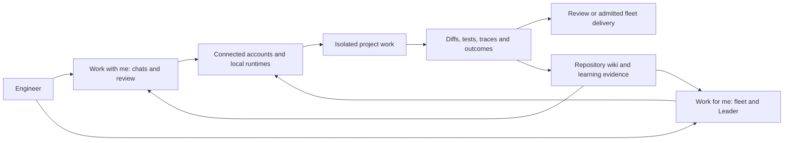

<a id="ashlr-universe"></a>

# Ashlr Verse

**Work with agents. Let agents work for you. One open-source workbench for your accounts, local models, chats and engineering fleet.**

**[verse.ashlr.ai](https://verse.ashlr.ai)**

[Install](#install) · [See the workbench](#what-it-is) · [Benchmarks](#benchmarks-and-traces) · [Read the guide](https://github.com/ashlrai/ashlr-hub/blob/master/docs/VERSE.md) · [Explore the ecosystem](https://verse.ashlr.ai/ecosystem) · [Star Verse on GitHub](https://github.com/ashlrai/ashlr-hub)

[](https://github.com/ashlrai/ashlr-hub/actions/workflows/ci.yml)
[](https://www.npmjs.com/package/@ashlr/hub)
[](https://www.npmjs.com/package/@ashlr/hub)
[](./LICENSE)
[](https://nodejs.org)

## Install

Install Verse 3.21.0 from its versioned GitHub release:

```sh
npm install -g https://github.com/ashlrai/ashlr-hub/releases/download/v3.21.0/ashlr-hub-3.21.0.tgz   # the `ashlr` CLI; Node.js 22.15+ and Git; macOS, Linux, Windows
ashlr verse                 # start the console at http://127.0.0.1:7777/verse/
```

On an Apple silicon Mac, download the
[v3.21.0 desktop DMG](https://github.com/ashlrai/ashlr-hub/releases/download/v3.21.0/Ashlr_3.21.0_aarch64_locally-signed.dmg).
It is locally signed, not Apple notarized; macOS may require **Open Anyway** on
first launch. The CLI includes the browser console on macOS, Linux and Windows.
See [desktop installation](#the-desktop-app-macos) or the
[first-run guide](docs/QUICKSTART.md#open-verse).


*Actual compiled 3.21 browser workbench with labeled demo accounts, sample usage and synthetic outcome counts.
No provider ran and no fleet was active for these screenshots. They show the web UI, not native app chrome.*

---

## What it is

**Ashlr Verse** is an operator console for coding agents. Every Claude Code,
Codex, Devin and Grok account you own becomes a *seat*, and so does every
tool-capable local model. Claude Code, Codex and Devin are equal partners:
routing picks among them by fit, headroom, cost and latency, never by brand. You
chat with any of them in one workbench. You hand work to Claude Code cloud
sessions, which keep running remotely on your signed-in Claude account, and to
Devin sessions. Eligible promotional credits are used first, then included plan
usage where available; paid-only models and enabled over-limit usage can use
purchased credits. A **Leader** plans the fleet's work
and talks with you in Verse, on Telegram or in the terminal. And the fleet works
your enrolled repositories only inside a standing grant you sign with Touch ID:
it starts in shadow, recording what it would merge, and climbs a rollout ladder
from there.

It ships as a macOS desktop app and as the `ashlr` CLI (`@ashlr/hub`), which
serves the same console in a browser on macOS, Linux and Windows. Under the
console is the Hub kernel: the CLI, the Universe experiment runtime and
account-aware resource pools.

Names stay compatible. The repository is `ashlr-hub`, the package is
`@ashlr/hub`, the command is `ashlr`, and experiments remain `ashlr universe`
with the `@ashlr/hub/universe` SDK. "Ashlrverse" is the wider project; existing
manifests, schemas and stores need no naming migration.

The user guide is [`docs/VERSE.md`](https://github.com/ashlrai/ashlr-hub/blob/master/docs/VERSE.md).

### What's in Verse 3.21

**Work with me** opens your interactive chats: guide the agent, inspect its
tools and context, review changes and continue on another account or local model.
**Work for me** opens the fleet: delegate tasks, review work, guide the Leader
and manage autonomous execution within the authority you sign. Both workspaces
share accounts and projects, and switching between them does not start work or
change permission mode. The app restores the workspace you last used.

| Work with me | Work for me |
|---|---|
| Guide a chat, choose an account or model, inspect tools and context, review its diff. | Delegate work, follow agents, steer the Leader and review fleet decisions. |
| Keep projects, drafts, terminals and source evidence together. | Keep account capacity, goals, outcomes and the work needing you together. |

**Review** opens the relevant changes, sources, usage, agents or decisions without
starting another run. Advanced preferences let you choose **No preference limit**
for goal counts, goal creation, Leader daily runs and Grok lanes. Finish-first is
an independent choice; changing a preference does not widen signed authority.

Connected resource rows keep a stable order, show cached readings immediately
when available, and refresh from shared metadata collection. Expand an account
for its actual windows, reset times and freshness. Missing readings remain
unknown; cloud credits remain a labelled estimate.

The fleet can prioritize useful work before a qualified account deadline.
It compares recorded durations for the same engine, model and task kind,
checks current account headroom, and uses optional Jev advice among eligible
task/account pairs. Expand Resources or Fleet capacity details to see the deadline, sample coverage,
estimated fit and last recorded advice. Missing history remains unknown;
quota percentages are never converted into invented token allowances.
See [reset-aware scheduling](docs/RESET-AWARE-SCHEDULING.md).

Subscription windows and usage credits are separate. An exhausted Codex
subscription can still have credits: the sidebar shows current native units,
spending holds and an estimated dollar value for known personal plans.
Purchased credit balances do not become reset spend-down targets. Cloud-credit
estimates and tracked Devin ACUs have no verified expiration in this release;
they do not acquire a deadline from a subscription reset.

Expand **Execution feedback** in Fleet for recorded producer outcomes, proposal
coverage and failure categories. A completed agent run is separate from verified
or shipped work. Exact failures without proposals become stable retros and
context for the Leader's existing planning loop. The panel reads shared local
records in the background; it opens without waiting for a scan or calling a
model. See [execution feedback](docs/EXECUTION-FEEDBACK.md).

Task fan-out has no fixed six-seat ceiling. Workspace retention defaults to 25;
`ASHLR_VERSE_AGENT_CAP=none` disables retention-driven automatic archiving, or
set a positive safe-integer capacity appropriate to your machine. Provider
quotas, local hardware, available ports and workspace isolation still apply.
Scheduling and cash-budget preferences no longer have the former preset UI
ceilings. The panel reports the current 64-item journal capacity per tick;
remaining work can continue on subsequent ticks.
The local module map, searchable model roster, efficiency plugin and phone
gateway remain available in both workflows.

The grant editor lets you review each listed account's enabled state, roles,
reserve and session ceiling. Set 0% reserve or No session ceiling explicitly
when appropriate; current usage, budget preferences and provider readiness still
determine eligibility. Editing a draft does not change the live grant.

An exhausted positive cash allowance keeps eligible resident subscription and
local work available without inventing dollar headroom. Actual metered or
unknown-cost work waits; explicit $0 remains the loop's Stop setting.

The read-only `ashlr openai-agents` CLI inspects managed OpenAI Agents session
metadata with a host-held API key. API access is separate from subscriptions,
and inventory does not qualify an execution seat. See the
[Agents integration guide](docs/OPENAI-AGENTS-INTEGRATION.md),
[Dots companion guide](docs/DOTS-COMPANION.md) and
[harness evolution plan](docs/AGENT-HARNESS-EVOLUTION.md) for the supported
commands and next integration steps.

| | What you get | Guide |
|---|---|---|
| **Talk to the Leader** | One conversation across Mind (⌘4), Telegram and `ashlr leader say`. Standing directives (`focus:`, `stop:`, `priority:`), answers to its questions, early approval or veto of its actions and Telegram buttons. In 3.15 it runs in founder mode: morning and evening briefs, an instant brief on "status", "go build X" turned into work under the grant, one question at a time, and a daily self-improvement pick. | [LEADER.md](https://github.com/ashlrai/ashlr-hub/blob/master/docs/LEADER.md) |
| **Autonomy with custody** | A Touch ID standing grant names repos, engines, change-volume limits and spend. Verified changes follow gates G0–G7; eligible agents under a signed elite-direct policy land without a separate judge. Merges are SHA-pinned, watched and reverted if red. Work for me shows the current grant and rollout state. | [AUTHORITY.md](https://github.com/ashlrai/ashlr-hub/blob/master/docs/AUTHORITY.md) |
| **A multi-seat workbench** | Claude Code, several Codex accounts, Grok, local models and Devin side by side, each pinned to its own profile. Auto seat, Compare, cheap-first and one-click handoff across seats. A panel of Terminal (command blocks, an Agent tab), Browser (observation by default; guarded actions under a separate grant), Changes (a checkpoint before every turn, Accept/Reject, Undo/Redo), Sources and Reasoning, plus focus mode. | [VERSE.md](https://github.com/ashlrai/ashlr-hub/blob/master/docs/VERSE.md) |
| **Resources, ready or not** | ⌘. shows every account, local runtime, cloud credits and Devin, each with a "Chat: ready" and a "Fleet: ready · reserve kept" line and the command that fixes it. | [VERSE.md](https://github.com/ashlrai/ashlr-hub/blob/master/docs/VERSE.md#resources-the-drawer-and-the-bar-311) |
| **Cloud and Devin** | Hand a scoped task to a Claude Code cloud or Devin lane for a reported PR, or chat in a separate Devin cloud or CLI seat. The signed-in Devin CLI defaults to Cognition SWE-2 High; cloud sessions use ACUs and do not report an underlying model. Lane PRs reach Needs you and the standing gates. Cloud Devin needs two judge families; eligible local CLI work can use a signed elite-direct grant. | [CLOUD.md](https://github.com/ashlrai/ashlr-hub/blob/master/docs/CLOUD.md), [DEVIN.md](https://github.com/ashlrai/ashlr-hub/blob/master/docs/DEVIN.md) |
| **A private repo wiki** | A searchable local module map with dependencies and cited files, an architecture wiki per repo with verified `file:line` citations, and Ask the codebase. Pages are stored on your Mac; generation prefers local models, but may send repository context to Grok when the grant and repository policy allow it. | [VERSE.md](https://github.com/ashlrai/ashlr-hub/blob/master/docs/VERSE.md#repo-wiki-and-ask-315) |
| **Lessons** | Every task end becomes a retro with a root cause, swept hourly. Knowledge it suggests is used only after you approve it, and only where its scope matches. | [VERSE.md](https://github.com/ashlrai/ashlr-hub/blob/master/docs/VERSE.md#lessons-retros-and-approved-knowledge-315) |
| **Playbooks and automations** | Versioned task templates, run with a `!macro` in any chat or lane; issues, red builds, schedules and webhooks that become work, through each lane's own gates. | [VERSE.md](https://github.com/ashlrai/ashlr-hub/blob/master/docs/VERSE.md#playbooks-315) |
| **Jev decisions** | One fast, typed decision layer with a rules fallback at every call site, advisory or escalate-only where safety is near. | [VERSE.md](https://github.com/ashlrai/ashlr-hub/blob/master/docs/VERSE.md#the-jev-decision-layer-315) |

**Status, plainly.** Autonomy ships dormant and is macOS-only. It turns on
only after you install the custody helper, sign a grant and start the resident
daemon yourself. A new grant starts at stage 1 of 8, shadow, where nothing
merges. A release that changes authority code pauses an existing grant until
Touch ID reapproval. Check the live grant, switch, Stop state and rollout stage
with `ashlr authority status`; a source document cannot establish that the
resident daemon is active on a particular Mac.

---

Each chat turn has a compact **Tools and context** panel showing reported calls,
MCP call counts, cited sources and recorded playbook references. The local Wiki
module map links inferred dependencies to checked source lines and reports scan
and resolver coverage. Both views use existing local evidence without additional
model calls.

## The desktop app (macOS)

The desktop app is a native window around Verse, with a menu-bar item,
notifications while it is hidden, a Dock badge for Needs-you items and the
Terminal pane in the chat dock. It bundles the `ashlr` CLI, so it needs no
separate Node.js install to run.

### Install

The [v3.21.0 release](https://github.com/ashlrai/ashlr-hub/releases/tag/v3.21.0)
includes an arm64 DMG. It is locally signed, not Apple Developer ID notarized,
so macOS may require **Open Anyway** on first launch. To build from source on a
trusted macOS checkout, use the local release script with the stable
"Ashlr Local" code-signing identity. The prerequisites, exact build order and
verification steps are in [Releasing without CI](https://github.com/ashlrai/ashlr-hub/blob/master/docs/RELEASING-LOCALLY.md)
and [Desktop app](https://github.com/ashlrai/ashlr-hub/blob/master/docs/VERSE.md#desktop-app-macos). In short, from a clean
repository root:

```sh
npm ci
npm run build:binary
node desktop/scripts/prepare-sidecar.mjs
(cd desktop && CI=true cargo tauri build)
test -d /Applications/Ashlr.app || ditto desktop/src-tauri/target/release/bundle/macos/Ashlr.app /Applications/Ashlr.app
npm run ship:local -- --native
```

The `ditto` step seeds a first install only; `ship:local --native` updates an
existing app with the prebuilt native binary and local signature. It does not
compile Rust. Verify that it copied the new binary and that the installed app
reports this release. A bare `cargo tauri build` can wrap stale web assets.

### Open

The local build is signed with "Ashlr Local", not Apple Developer ID notarized.
macOS may still require right-click **Open** or **Open Anyway** on first launch.
The first signing setup may also ask for your login password and **Always Allow**
for the signing key. A small launch window says what is
happening while the bundled server starts on `127.0.0.1:7777`. The Verse window
then opens with its tokens already handed over, so there is nothing to paste.
Closing the window hides it to the menu bar; **Quit** stops the server.

On first launch a two-minute tour shows which seats this Mac can use, whether
there is a local model, and the three ways to stop things.

### Sign in your seats

A seat is one account and the CLI that drives it, pinned to its own profile so a
turn can never land on the wrong account. Verse never asks for or stores a
credential; each vendor CLI signs itself in.

1. **Prepare a private profile** for each account. For the Claude seat the cloud
   lane uses:

   ```sh
   ashlr resources profile prepare --provider claude \
     --directory ~/.ashlr/native-profiles/claude-a \
     --executable /absolute/path/to/the/claude/binary --json
   ```

   Use `--provider codex` or `--provider grok` for those accounts, with a new
   directory each time. Nothing is signed in yet.
2. **Sign in** with the `loginCommand` the command printed: `auth login
   --claudeai` for Claude, `login` for Codex, `--no-auto-update login --oauth`
   for Grok. Finish the vendor's browser flow as the intended account.
3. **List the account** in `~/.ashlr/account-connections/connections.json`,
   using the `command` from step 1:

   ```json
   {
     "schemaVersion": 1,
     "intervalMs": 30000,
     "accounts": [
       { "id": "claude-a", "label": "Claude Max", "provider": "claude",
         "command": ["/absolute/node", "/Users/you/.ashlr/native-profiles/claude-a/launcher.mjs"] }
     ]
   }
   ```

4. **Reopen Verse.** The account appears as a seat in the composer and in
   **Apps & Accounts**, which shows its health, windows and resets. A background
   sweep checks every seat every 10 minutes with status commands only.
   **Reconnect** opens the seat's own login in Terminal.

Local models need no sign-in. If Ollama is running, every tag that supports tool
use becomes a local seat. The account commissioning details, including how to
check identity and quota, are in
[Resource Pools](https://github.com/ashlrai/ashlr-hub/blob/master/docs/RESOURCE-POOLS.md#commission-native-accounts-and-local-capacity).

---

## The CLI

The same console runs from the CLI on macOS, Linux and Windows. It needs Node.js
22.15 or newer and Git.

```sh
npm install -g https://github.com/ashlrai/ashlr-hub/releases/download/v3.21.0/ashlr-hub-3.21.0.tgz
ashlr --version
ashlr verse                 # start the server and open http://127.0.0.1:7777/verse/
```

`ashlr verse` prints two tokens. Paste the **read token** into the page once. It
asks for the **mutation token** the first time you start a chat or change
something. The server listens on `127.0.0.1` only, and neither token is written
to disk. `ashlr verse --no-open --json` prints one machine-readable line instead
of the banner.

What differs from the desktop app: the chat dock's Terminal pane needs the
desktop app's runtime (the browser gets **Open in Terminal.app** instead), and
the custody helper behind autonomy is macOS-only (a Secure Enclave key and Touch
ID).

---

## Quickstart

1. **Install** the desktop app or the CLI (above), and open Verse.
2. **Sign in your seats** (above). Start `ollama serve` for local seats.
3. **Open a project.** **New chat** (⌘N) picks a seat and a folder; in the
   desktop app **Choose folder…** opens the native picker. Saving a folder as a
   project never enrolls it for unattended work.
4. **Chat.** The composer takes attachments, `@` files and `/` commands, and
   queues up to 3 turns while one runs. The context meter shows the model's real
   window and compaction point; **Continue in a fresh chat** hands off with a
   note built without a model call. ⌘K reaches every chat, action and seat; ⌘J
   opens Needs you.
5. **Optionally run the local fast lane.** `ashlr local-runtime start --slots 4`
   starts llama-server with batching slots, and
   `ASHLR_VERSE_LOCAL_DISPATCH=llama-server` in Verse's environment sends local
   turns to it. Model discovery stays on Ollama.
6. **Optionally hand work to the cloud or to Devin.** **New cloud task** on
   Command, or `ashlr cloud launch "<task>" --repo owner/name`
   ([cloud lane](#the-cloud-and-devin-lanes)). For Devin, `ashlr devin connect` once,
   then a **Devin (cloud)** chat, **Run in Devin** from a chat, or
   `ashlr devin launch "<task>"`.
7. **Talk to the Leader.** Open Mind (⌘4), or `ashlr leader say "focus: …"`.
   `ashlr comms setup-telegram` adds a two-way Telegram line.
8. **Inspect autonomy preparation** with `ashlr authority setup --dry-run --json`
   and `ashlr authority status`. Guided setup can prepare prerequisites after
   your explicit actions; once your standing grant is active,
   `ashlr authority resident start` runs the resident fleet under it.
   `ashlr authority protect --print` reviews GitHub changes. Updates preserve
   existing rules, rule options and check App pins; incompatible or unfamiliar
   top-level policies need review. Before writing, the updater rechecks all
   selected existing policies and checks each again before its update. These
   checks reduce the race window; they are not an atomic GitHub transaction.

---

## Autonomy

Autonomy ships **dormant** and is macOS-only: nothing runs until you install the
custody helper, sign a Touch ID standing grant and start the resident daemon
yourself. Inspect it with `ashlr authority setup --dry-run` and
`ashlr authority status`. The full commissioning path, grant limits and budget
modes are in [Autonomy setup](https://github.com/ashlrai/ashlr-hub/blob/master/docs/AUTONOMY-SETUP.md).

Verse 3.16 changes authority code. After installing, reapprove an existing
grant with `ashlr authority re-approve` and restart the resident service from
your terminal. Check its actual state with `ashlr authority resident status`;
source documentation cannot establish that it is active on a particular Mac.

---

## Resources, on every page

Press **⌘.** (or click the tab on the right edge, or run "Open Resources" from ⌘K) to open the Resources drawer:
every resource grouped by tier — **Elite** (Claude Code, every Codex account, Devin, Claude cloud credits),
**Fast** (Grok) and **Free · local** (one card for Ollama, LM Studio and llama-server). Every card reads the same
way: tier, cost basis, models, status, usage against its window or budget, the share kept for you, and two
readiness lines, "Chat: ready / why" and "Fleet: ready · reserve kept / why", with the command that fixes it. It
opens over your work or pins as a column beside it, and a dot on the edge tab tells you at a glance whether
everything is usable.

Without opening anything, the **resource bar** in the rail foot keeps every resource in view. It shows one battery
per account with how much of its window is left, plus your local models and your cloud credits. Each row carries
the provider's own mark: Anthropic's Claude, OpenAI, xAI's Grok or Ollama. Hover a row for every window, its reset
and the share kept for you, or click it to open the drawer. **Hide resource bar** is in the drawer's footer and in
⌘K.

## Working on Verse itself

```sh
npm run gate          # minutes, not half an hour: static checks + the tests your change can reach
npm run ship:local -- --native  # after a native build: install CLI and locally sign Ashlr.app
```

Then `npm publish` the tarball `ship:local` prints. `npm run gate:full` runs every suite. See
[`docs/RELEASING-LOCALLY.md`](https://github.com/ashlrai/ashlr-hub/blob/master/docs/RELEASING-LOCALLY.md).

## The cloud and Devin lanes

Verse can hand a task to a **Claude Code cloud session** (`ashlr cloud launch
"<task>"`) or, off by default, to **Devin** (`ashlr devin connect`, then
`ashlr devin launch "<task>"`). Each task is asked to deliver one draft PR, and
nothing in the cloud lane merges. Overview: [Cloud and Devin lanes](https://github.com/ashlrai/ashlr-hub/blob/master/docs/CLOUD-LANES.md);
details: [`docs/CLOUD.md`](https://github.com/ashlrai/ashlr-hub/blob/master/docs/CLOUD.md) and [`docs/DEVIN.md`](https://github.com/ashlrai/ashlr-hub/blob/master/docs/DEVIN.md).

The local Devin CLI seat defaults to Cognition SWE-2 High; the ACU-metered cloud
seat does not identify its underlying model. Cloud Devin still needs the signed
stage and two independent judge families for a merge. Eligible CLI work can
use a separately signed elite-direct ceiling.

---

## Benchmarks and traces

Run no model to inspect help or compare compatible saved reports:

```sh
ashlr benchmark --help
ashlr benchmark --compare-reports BASELINE.json CANDIDATE.json
```

Run a synthetic coding task explicitly against your configured local runtime:

```sh
ashlr benchmark run --task multi-file-rename --trials 1 --concurrency 1 --out report.json
```

The harness records checker results, runtime configuration, wall time, usage
coverage and private request traces. Failed coding tasks return a failing exit
status. Comparisons require matching tasks, runtime configuration and recorded
cache conditions; missing token counts stay unknown. These are tools for
measuring changes, and do not add an eval gate to fleet dispatch.

Review real project changes in the chat's Changes panel, alongside reported tool
calls and source evidence. See the [harness guide](docs/AGENT-HARNESS-EVOLUTION.md#evidence-without-a-new-dispatch-gate)
for offline and online boundaries, trace privacy and comparison details.

## Reference

The Hub underneath the console (the Universe experiment kernel, resource pools,
the legacy enrolled-repository fleet and its activation runbook, the kill
switch, backends, sandboxing, the command reference, the safety model, the
`~/.ashlr/` layout and configuration) is documented in
[Hub reference](https://github.com/ashlrai/ashlr-hub/blob/master/docs/HUB-REFERENCE.md). Start with the
[executable Universe demo](https://github.com/ashlrai/ashlr-hub/blob/master/docs/DEMO.md), which needs no model account.

---

## Version history

| Series | Theme | Status |
|--------|-------|--------|
| **v1** (M1–M20) | Local command center — Desktop index, MCP gateway, agent orchestrator, genome | Shipped |
| **v2** (M21–M30) | Autonomous org — sandboxed swarms, Approval Inbox, enrollment, kill-switch | Shipped |
| **v2.1** (H1–H8) | Harden and prove — adversarial test suite, safety invariants proven by tests | Shipped |
| **v2.2** (M31–M33) | Agent-native — plugin system, Raycast, update channel | Shipped |
| **v3-Weapon** (M41–M44) | Local Weapon — adaptive model-sized prompts, sandboxed engineer tool surface, verify→repair, eval | Shipped |
| **v3-Team** (M34–M40) | Team Command Center — multi-machine inbox, coordinated daemons, team visibility | **Spec'd, not built** — see [`docs/SPEC-V3-TEAM.md`](https://github.com/ashlrai/ashlr-hub/blob/master/docs/SPEC-V3-TEAM.md) |
| **v4** (M45–M49) | Foundry — multi-backend engines, backend router, tiered-trust merge gate, HMAC provenance, fleet supervisor | Shipped |
| **v5** (M50–M55) | Open Fleet — declarative engine registry, tri-tier trust, OS confinement, fleet intelligence, self-improving fleet, goal/loop conductor | Shipped |
| **v5.1** (M320–M324) | Claude 5 Model Intelligence — Sonnet 5 workhorse routing, Fable 5 judge with Opus fallback, per-model ROI telemetry, cost-aware learned routing | Shipped |
| **v6** (M331–M340) | Verification-First — verify-to-green repair loop, real-world outcome watcher, multi-model best-of-N, gateway shadow activation program, Models dashboard tab, SWE-bench regression gate | Shipped |
| **3.5–3.8** | Ashlr Verse — the operator console, local seats on llama.cpp, a native folder picker, bounded run windows, local-only that actually prevents spend | Shipped |
| **3.9** | Context — windows read from each CLI, visible compaction, standard and expansive modes, continue in a fresh chat, shared project memory | Shipped |
| **3.10** | Autonomy with custody and the workbench — Touch ID grants, budget modes, the Leader, five surfaces, ⌘K and ⌘J, the dock, live reasoning, charts, burn-down history | Shipped |
| **3.11** | The cloud lane: Claude Code cloud sessions on Claude credits, with an estimated budget and self-improvement. Also the Resources drawer (⌘.) and the always-on resource bar, provider logos, the Ashlr.AI mark, a 349 KB first paint, and `npm run gate` / `npm run ship:local` | Released |
| **3.12–3.13** | Your key is the trust root; guided `ashlr authority setup`; the host-verified `ashlr/verify` check; cloud PRs into the standing gates; the resident runtime under a standing grant (`ashlr authority resident start`) | Shipped |
| **3.14** | Talk to the Leader in Verse, Telegram and the CLI; Leader reliability; accounts ready in both chat and fleet; the rollout ladder on Command and shadow decisions on Fleet; local enforcement for free-plan private repos; `file:../` sibling dependencies; a sidecar that cannot freeze; chart polish | Shipped |
| **3.15** | Founder-mode Leader; Devin as chat seats, a lane and a fleet producer under a two-judge rule; the workbench panel (terminal blocks, browser, checkpoints, sources and reasoning); every seat together; playbooks and automations; the Jev decision layer; retros and approved knowledge (Growth ▸ Lessons); a private repo wiki and Ask | Included in the published 3.16 release |
| **3.20** | Reset-aware task/account choices, recorded work estimates, Jev advice and optional decision-call preferences | [3.21.0 release](https://github.com/ashlrai/ashlr-hub/releases/tag/v3.21.0) |
| **3.19 workbench changes** | Faster progressive resource readings, expandable usage details, optional goal and Leader preferences, Review navigation and explicit benchmark commands | Included in [3.21.0](https://github.com/ashlrai/ashlr-hub/releases/tag/v3.21.0) |
| **3.18** | Work with me and Work for me, configurable fleet volume, scalable workspace retention and comparable usage reports | [3.18.0 release](https://github.com/ashlrai/ashlr-hub/releases/tag/v3.18.0) |
| **3.17** | Local module map, scalable account/model rosters, portable efficiency-plugin connection and phone reliability | [3.17.2 release](https://github.com/ashlrai/ashlr-hub/releases/tag/v3.17.2) |
| **3.16** | Native Agents workbench and guarded computer tools; optional authenticated phone gateway; reviewable learning evidence; Devin CLI SWE-2 High default; local signing and release fixes | [3.16.1 published](https://github.com/ashlrai/ashlr-hub/releases/tag/v3.16.1) |

Release artifacts are built and published locally; the source also runs GitHub
CI and dependency audit checks. The local build procedure is in [Releasing without CI](https://github.com/ashlrai/ashlr-hub/blob/master/docs/RELEASING-LOCALLY.md).
npm publication is confirmed separately with `npm view @ashlr/hub version`.
GitHub release assets require their own public download and checksum verification;
repository or changelog state alone is not publication evidence.

---

## The Ashlr ecosystem

Verse is the flagship workbench. These related open-source projects solve
different parts of a developer's workflow and remain useful on their own:

Explore the [interactive ecosystem page](https://verse.ashlr.ai/ecosystem) for a
dated, GitHub-sourced star history of these six repositories and their sum.

| Project | What it helps with |
|---------|--------------------|
| **[Ashlr Verse](https://github.com/ashlrai/ashlr-hub)** | Coordinate coding agents, accounts, local models and guarded fleet work from one console. |
| **[Phantom](https://github.com/ashlrai/phantom-secrets)** | Keep real API keys out of agent context with local tokens and a network-edge proxy. |
| **[Locus](https://github.com/ashlrai/locus)** | Pin the account and workspace identity under which an agent acts. |
| **[Lexicon](https://github.com/ashlrai/lexicon)** | Correct names and technical terms that speech-to-text gets wrong before they reach an agent. |
| **[AshlrCode](https://github.com/ashlrai/ashlrcode)** | Run a multi-provider coding agent in the terminal. |
| **[Morphkit](https://github.com/ashlrai/morphkit)** | Turn a TypeScript/React app into a SwiftUI project. |

The [ecosystem map](https://github.com/ashlrai/ashlr-hub/blob/master/docs/ECOSYSTEM-MAP.md) records older composition ideas; it
is a dated planning snapshot, not a claim that every integration is live. Each
repository has its own install instructions, release state and star count.

## Documentation

The [documentation map](https://github.com/ashlrai/ashlr-hub/blob/master/docs/README.md) separates current operation, the North
Star and source-maintainer references. Start with these canonical guides:

| Doc | What it covers |
|-----|----------------|
| [`docs/VERSE.md`](https://github.com/ashlrai/ashlr-hub/blob/master/docs/VERSE.md) | The Verse user guide: every surface and shortcut, chat workbench, seats, Resources, Lessons, the repo wiki, autonomy, the cloud and Devin lanes, the desktop app |
| [`docs/HUB-REFERENCE.md`](https://github.com/ashlrai/ashlr-hub/blob/master/docs/HUB-REFERENCE.md) | The Hub underneath the console: Universe experiments, resource pools, the legacy fleet and its activation runbook, kill switch, backends, sandboxing, command reference, safety model, configuration |
| [`docs/AUTONOMY-SETUP.md`](https://github.com/ashlrai/ashlr-hub/blob/master/docs/AUTONOMY-SETUP.md) | The autonomy commissioning path, what a grant allows, and budget modes |
| [`docs/CLOUD-LANES.md`](https://github.com/ashlrai/ashlr-hub/blob/master/docs/CLOUD-LANES.md) | Overview of the Claude Code cloud lane and the Devin lane |
| [`docs/REMOTE-PHONE.md`](https://github.com/ashlrai/ashlr-hub/blob/master/docs/REMOTE-PHONE.md) | Optional phone gateway, Access enrollment, and local setup; remote access remains off until configured |
| [`docs/CLOUD.md`](https://github.com/ashlrai/ashlr-hub/blob/master/docs/CLOUD.md) | The cloud lane: launch mechanics, delivery contract, estimated budget, self-improvement, failure codes, and how the Devin lane compares |
| [`docs/LEADER.md`](https://github.com/ashlrai/ashlr-hub/blob/master/docs/LEADER.md) | Talking to the Leader: Mind, Telegram commands, buttons and briefs, founder mode, the CLI, directives, approvals, check-ins |
| [`docs/DEVIN.md`](https://github.com/ashlrai/ashlr-hub/blob/master/docs/DEVIN.md) | Devin: chat seats, setup, ACU budget, delivery contract, the fleet launcher, the two-judge rule, limits |
| [`docs/AUTHORITY.md`](https://github.com/ashlrai/ashlr-hub/blob/master/docs/AUTHORITY.md) | The owner's contract: custody, Stop and Revoke, setup, the resident step, residual risks |
| [`docs/VERSE-CONTEXT.md`](https://github.com/ashlrai/ashlr-hub/blob/master/docs/VERSE-CONTEXT.md) | Context windows, compaction, standard and expansive modes, handoff and shared memory |
| [`docs/STANDING-AUTHORITY.md`](https://github.com/ashlrai/ashlr-hub/blob/master/docs/STANDING-AUTHORITY.md) | Touch ID grants, the rollout ladder, merge gates and the ledger |
| [`docs/NORTH-STAR.md`](https://github.com/ashlrai/ashlr-hub/blob/master/docs/NORTH-STAR.md) | Target outcome: verified engineering yield, evolving objectives and independent ecosystem products |
| [`docs/QUICKSTART.md`](https://github.com/ashlrai/ashlr-hub/blob/master/docs/QUICKSTART.md) | Run the current local kernel, inspect results and choose the correct commissioning path |
| [`docs/ASHLR-UNIVERSE.md`](https://github.com/ashlrai/ashlr-hub/blob/master/docs/ASHLR-UNIVERSE.md) | Experiments, campaigns, portfolio orchestration, evidence graphs and pinned local runtime |
| [`docs/RESOURCE-POOLS.md`](https://github.com/ashlrai/ashlr-hub/blob/master/docs/RESOURCE-POOLS.md) | Native account/local worker commissioning, quotas, foreground queue, fleet map and calibration |
| [Local verification and release](https://github.com/ashlrai/ashlr-hub/blob/master/docs/RELEASING.md) | Source-maintainer procedure; local candidate, npm publication and runtime activation remain distinct |
| [`docs/ARCHITECTURE.md`](https://github.com/ashlrai/ashlr-hub/blob/master/docs/ARCHITECTURE.md) | Module map, the autonomous loop, engine tiers, safety gates, the `~/.ashlr/` layout |
| [`docs/MILESTONE-INDEX.md`](https://github.com/ashlrai/ashlr-hub/blob/master/docs/MILESTONE-INDEX.md) | Historical milestone ID → subject → status lookup, including confirmed ID collisions; not runtime activation evidence |
| [`docs/MISSION-OS.md`](https://github.com/ashlrai/ashlr-hub/blob/master/docs/MISSION-OS.md) | Mission DAG, receipts, shadow workflow, Cortex/Locus boundaries, privacy, and troubleshooting |
| [`docs/ELITE-AGENT-EFFICIENCY.md`](https://github.com/ashlrai/ashlr-hub/blob/master/docs/ELITE-AGENT-EFFICIENCY.md) | Current primary-source research translated into Hub efficiency priorities and measurable autonomy gates |
| [`docs/RUNTIME_ACTIVATION_AUTHORITY.md`](https://github.com/ashlrai/ashlr-hub/blob/master/docs/RUNTIME_ACTIVATION_AUTHORITY.md) | Signed read-only resident activation admission, explicit mutation refusal, and native launchd v2 requirements |
| [`docs/ECOSYSTEM-MAP.md`](https://github.com/ashlrai/ashlr-hub/blob/master/docs/ECOSYSTEM-MAP.md) | Independent product capabilities and composition bets |
| [`docs/LOCUS-FIRM-FLEET.md`](https://github.com/ashlrai/ashlr-hub/blob/master/docs/LOCUS-FIRM-FLEET.md) | Production fleet checklist — `locus.firm`, `LOCUS_ENFORCE`, `LOCUS_CI_BINDING` (default off) |
| [`docs/FOUNDRY-CONFIG.md`](https://github.com/ashlrai/ashlr-hub/blob/master/docs/FOUNDRY-CONFIG.md) | Full `cfg.foundry` reference — engines, tiers, confinement, auto-merge |
| [`docs/RELIABILITY.md`](https://github.com/ashlrai/ashlr-hub/blob/master/docs/RELIABILITY.md) | Fault-tolerance and degradation guarantees |
| [`docs/SPEC-V4-FOUNDRY.md`](https://github.com/ashlrai/ashlr-hub/blob/master/docs/SPEC-V4-FOUNDRY.md) · [`docs/SPEC-V5-OPEN-FLEET.md`](https://github.com/ashlrai/ashlr-hub/blob/master/docs/SPEC-V5-OPEN-FLEET.md) · [`docs/SPEC-V6-VERIFICATION.md`](https://github.com/ashlrai/ashlr-hub/blob/master/docs/SPEC-V6-VERIFICATION.md) | The design specs behind each version series (incl. the full safety-invariant set) |

## Contributing

See [CONTRIBUTING.md](https://github.com/ashlrai/ashlr-hub/blob/master/CONTRIBUTING.md) — dev setup, test conventions, and the safety invariants contributors must never weaken.

## Architecture


```mermaid
flowchart LR
  Engineer[Engineer] --> Chats[Work with me: chats and review]
  Engineer --> Fleet[Work for me: fleet and Leader]
  Chats --> Accounts[Connected accounts and local runtimes]
  Fleet --> Accounts
  Accounts --> Work[Isolated project work]
  Work --> Evidence[Diffs, tests, traces and outcomes]
  Evidence --> Review[Review or admitted fleet delivery]
  Evidence --> Lessons[Repository wiki and learning evidence]
  Lessons --> Chats
  Lessons --> Fleet
```


See [docs/ARCHITECTURE.md](https://github.com/ashlrai/ashlr-hub/blob/master/docs/ARCHITECTURE.md) — module map, the autonomous loop, engine tiers, safety gates, and the self-improvement layer.

## License

MIT — see [LICENSE](LICENSE).
