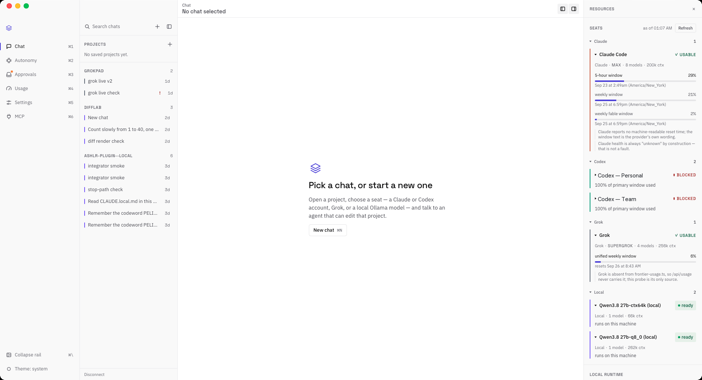

<a id="ashlr-universe"></a>

# Ashlr Verse

**One console for every coding agent you run, a Leader you can talk to, and a fleet that merges only inside a scope you sign.**

**[verse.ashlr.ai](https://verse.ashlr.ai)**

[](https://www.npmjs.com/package/@ashlr/hub)
[](https://www.npmjs.com/package/@ashlr/hub)
[](./LICENSE)
[](https://nodejs.org)

## Install

```sh
npm install -g @ashlr/hub   # the `ashlr` CLI; Node.js 22.15+ and Git; macOS, Linux, Windows
ashlr verse                 # start the console at http://127.0.0.1:7777/verse/
```

The macOS desktop app is built from source for now (no public installer yet):
see [The desktop app](#the-desktop-app-macos). Then follow the [Quickstart](#quickstart).



---

## What it is

**Ashlr Verse** is an operator console for coding agents. Every Claude Code,
Codex and Grok account you own becomes a *seat*, and so does every tool-capable
local model. You chat with any of them in one workbench. You hand work to
Claude Code cloud sessions, which keep running on your Claude credits after the
subscription window is spent, and to Devin. A **Leader** plans the fleet's work
and talks with you in Verse, on Telegram or in the terminal. And the fleet works
your enrolled repositories only inside a standing grant you sign with Touch ID:
it starts in shadow, recording what it would merge, and climbs a rollout ladder
from there.

It ships as a macOS desktop app and as the `ashlr` CLI (`@ashlr/hub`), which
serves the same console in a browser on macOS, Linux and Windows. Under the
console is the Hub kernel: the CLI, the Universe experiment runtime and
account-aware resource pools.

Names stay compatible. The repository is `ashlr-hub`, the package is
`@ashlr/hub`, the command is `ashlr`, and experiments remain `ashlr universe`
with the `@ashlr/hub/universe` SDK. "Ashlrverse" is the wider project; existing
manifests, schemas and stores need no naming migration.

The user guide is [`docs/VERSE.md`](https://github.com/ashlrai/ashlr-hub/blob/master/docs/VERSE.md).

### What's in Verse 3.15

| | What you get | Guide |
|---|---|---|
| **Talk to the Leader** | One conversation across Mind (⌘4), Telegram and `ashlr leader say`. Standing directives (`focus:`, `stop:`, `priority:`), answers to its questions, early approval or veto of its actions and Telegram buttons. In 3.15 it runs in founder mode: morning and evening briefs, an instant brief on "status", "go build X" turned into work under the grant, one question at a time, and a daily self-improvement pick. | [LEADER.md](https://github.com/ashlrai/ashlr-hub/blob/master/docs/LEADER.md) |
| **Autonomy with custody** | A Touch ID standing grant names repos, engines, caps and spend. Every change passes gates G0–G7 and a judge from another model family; merges are SHA-pinned, watched for two hours and reverted if red. Command shows the rollout ladder (stage x of 8); Fleet shows every shadow decision and why. | [STANDING-AUTHORITY.md](https://github.com/ashlrai/ashlr-hub/blob/master/docs/STANDING-AUTHORITY.md) |
| **A multi-seat workbench** | Claude Code, several Codex accounts, Grok, local models and Devin side by side, each pinned to its own profile. Auto seat, Compare, cheap-first and one-click handoff across seats. A panel of Terminal (command blocks, an Agent tab), Browser (agents can look, never click), Changes (a checkpoint before every turn, Accept/Reject, Undo/Redo), Sources and Reasoning, plus focus mode. | [VERSE.md](https://github.com/ashlrai/ashlr-hub/blob/master/docs/VERSE.md) |
| **Resources, ready or not** | ⌘. shows every account, local runtime, cloud credits and Devin, each with a "Chat: ready" and a "Fleet: ready · reserve kept" line and the command that fixes it. | [VERSE.md](https://github.com/ashlrai/ashlr-hub/blob/master/docs/VERSE.md#resources-the-drawer-and-the-bar-311) |
| **Cloud and Devin** | Hand a task to a Claude Code cloud session or a Devin session, or chat with Devin (cloud or CLI). Each task delivers one PR with a report; Needs you shows a gate verdict and Land, Close, Update branch. A Devin PR merges only at a grant stage that names Devin, with two judges from different families. | [CLOUD.md](https://github.com/ashlrai/ashlr-hub/blob/master/docs/CLOUD.md), [DEVIN.md](https://github.com/ashlrai/ashlr-hub/blob/master/docs/DEVIN.md) |
| **A private repo wiki** | An architecture wiki per repo with verified `file:line` citations, and Ask the codebase, written by your local models (Grok only if the grant allows, never Claude) and stored only on your Mac. | [VERSE.md](https://github.com/ashlrai/ashlr-hub/blob/master/docs/VERSE.md#repo-wiki-and-ask-315) |
| **Lessons** | Every task end becomes a retro with a root cause, swept hourly. Knowledge it suggests is used only after you approve it, and only where its scope matches. | [VERSE.md](https://github.com/ashlrai/ashlr-hub/blob/master/docs/VERSE.md#lessons-retros-and-approved-knowledge-315) |
| **Playbooks and automations** | Versioned task templates, run with a `!macro` in any chat or lane; issues, red builds, schedules and webhooks that become work, through each lane's own gates. | [VERSE.md](https://github.com/ashlrai/ashlr-hub/blob/master/docs/VERSE.md#playbooks-315) |
| **Jev decisions** | One fast, typed decision layer with a rules fallback at every call site, advisory or escalate-only where safety is near. | [VERSE.md](https://github.com/ashlrai/ashlr-hub/blob/master/docs/VERSE.md#the-jev-decision-layer-315) |

**Status, plainly.** Autonomy ships dormant. It turns on only after you install
the custody helper, sign a grant and start the resident daemon yourself, and it
is macOS-only. On the maintainer's Mac a grant is active and the ladder is at
stage 1 of 8, shadow, where nothing merges. That grant does not name Devin,
so the fleet starts no Devin sessions and Devin PRs stay shadow. What is
activated where is kept current in
[AUTONOMY-GAP.md](docs/AUTONOMY-GAP.md#current-activation-state-315).

---

## The desktop app (macOS)

The desktop app is a native window around Verse, with a menu-bar item,
notifications while it is hidden, a Dock badge for Needs-you items and the
Terminal pane in the chat dock. It bundles the `ashlr` CLI, so it needs no
separate Node.js install to run.

### Install

There is no public installer and the build is unsigned. You build it once on
your Mac and keep it in the Dock. The full sequence, prerequisites (Rust with
`tauri-cli` 2, Bun, Node, Xcode command line tools) and the checks that the
bundle carries the current assets are in
[Desktop app](https://github.com/ashlrai/ashlr-hub/blob/master/docs/VERSE.md#desktop-app-macos).
In short, from the repository root:

```sh
npm ci
npm run build:binary                       # the CLI as one executable, web assets included
node desktop/scripts/prepare-sidecar.mjs   # stage it inside the app
cd desktop && npm run icons && CI=true cargo tauri build
rm -rf /Applications/Ashlr.app
cp -R src-tauri/target/release/bundle/macos/Ashlr.app /Applications/
```

Run all of those steps every time. A bare `cargo tauri build` wraps a new shell
around whatever web assets an earlier build left behind.

### Open

The first time, right-click `Ashlr.app` and choose **Open**, because the build is
unsigned. After that it opens normally. A small launch window says what is
happening while the bundled server starts on `127.0.0.1:7777`. The Verse window
then opens with its tokens already handed over, so there is nothing to paste.
Closing the window hides it to the menu bar; **Quit** stops the server.

On first launch a two-minute tour shows which seats this Mac can use, whether
there is a local model, and the three ways to stop things.

### Sign in your seats

A seat is one account and the CLI that drives it, pinned to its own profile so a
turn can never land on the wrong account. Verse never asks for or stores a
credential; each vendor CLI signs itself in.

1. **Prepare a private profile** for each account. For the Claude seat the cloud
   lane uses:

   ```sh
   ashlr resources profile prepare --provider claude \
     --directory ~/.ashlr/native-profiles/claude-a \
     --executable /absolute/path/to/the/claude/binary --json
   ```

   Use `--provider codex` or `--provider grok` for those accounts, with a new
   directory each time. Nothing is signed in yet.
2. **Sign in** with the `loginCommand` the command printed: `auth login
   --claudeai` for Claude, `login` for Codex, `--no-auto-update login --oauth`
   for Grok. Finish the vendor's browser flow as the intended account.
3. **List the account** in `~/.ashlr/account-connections/connections.json`,
   using the `command` from step 1:

   ```json
   {
     "schemaVersion": 1,
     "intervalMs": 30000,
     "accounts": [
       { "id": "claude-a", "label": "Claude Max", "provider": "claude",
         "command": ["/absolute/node", "/Users/you/.ashlr/native-profiles/claude-a/launcher.mjs"] }
     ]
   }
   ```

4. **Reopen Verse.** The account appears as a seat in the composer and in
   **Apps & Accounts**, which shows its health, windows and resets. A background
   sweep checks every seat every 10 minutes with status commands only.
   **Reconnect** opens the seat's own login in Terminal.

Local models need no sign-in. If Ollama is running, every tag that supports tool
use becomes a local seat. The account commissioning details, including how to
check identity and quota, are in
[Resource Pools](docs/RESOURCE-POOLS.md#commission-native-accounts-and-local-capacity).

---

## The CLI

The same console runs from the CLI on macOS, Linux and Windows. It needs Node.js
22.15 or newer and Git.

```sh
npm install -g @ashlr/hub
ashlr --version
ashlr verse                 # start the server and open http://127.0.0.1:7777/verse/
```

`ashlr verse` prints two tokens. Paste the **read token** into the page once. It
asks for the **mutation token** the first time you start a chat or change
something. The server listens on `127.0.0.1` only, and neither token is written
to disk. `ashlr verse --no-open --json` prints one machine-readable line instead
of the banner.

What differs from the desktop app: the chat dock's Terminal pane needs the
desktop app's runtime (the browser gets **Open in Terminal.app** instead), and
the custody helper behind autonomy is macOS-only (a Secure Enclave key and Touch
ID).

---

## Quickstart

1. **Install** the desktop app or the CLI (above), and open Verse.
2. **Sign in your seats** (above). Start `ollama serve` for local seats.
3. **Open a project.** **New chat** (⌘N) picks a seat and a folder; in the
   desktop app **Choose folder…** opens the native picker. Saving a folder as a
   project never enrolls it for unattended work.
4. **Chat.** The composer takes attachments, `@` files and `/` commands, and
   queues up to 3 turns while one runs. The context meter shows the model's real
   window and compaction point; **Continue in a fresh chat** hands off with a
   note built without a model call. ⌘K reaches every chat, action and seat; ⌘J
   opens Needs you.
5. **Optionally run the local fast lane.** `ashlr local-runtime start --slots 4`
   starts llama-server with batching slots, and
   `ASHLR_VERSE_LOCAL_DISPATCH=llama-server` in Verse's environment sends local
   turns to it. Model discovery stays on Ollama.
6. **Optionally hand work to the cloud or to Devin.** **New cloud task** on
   Command, or `ashlr cloud launch "<task>" --repo owner/name`
   ([cloud lane](#the-cloud-and-devin-lanes)). For Devin, `ashlr devin connect` once,
   then a **Devin (cloud)** chat, **Run in Devin** from a chat, or
   `ashlr devin launch "<task>"`.
7. **Talk to the Leader.** Open Mind (⌘4), or `ashlr leader say "focus: …"`.
   `ashlr comms setup-telegram` adds a two-way Telegram line.
8. **Inspect autonomy preparation** with `ashlr authority setup --dry-run --json`
   and `ashlr authority status`. Guided setup can prepare prerequisites after
   your explicit actions; once your standing grant is active,
   `ashlr authority resident start` runs the resident fleet under it.

---

## Autonomy

Autonomy ships **dormant** and is macOS-only: nothing runs until you install the
custody helper, sign a Touch ID standing grant and start the resident daemon
yourself. Inspect it with `ashlr authority setup --dry-run` and
`ashlr authority status`. The full commissioning path, grant limits and budget
modes are in [Autonomy setup](https://github.com/ashlrai/ashlr-hub/blob/master/docs/AUTONOMY-SETUP.md).

---


## Resources, on every page

Press **⌘.** (or click the tab on the right edge, or run "Open Resources" from ⌘K) to open the Resources drawer:
every Claude, Codex and Grok account with its live 5-hour and weekly windows, the share kept for you, reset times
and Reconnect / Check again; your local models (one card for Ollama, LM Studio and llama-server) with runtime
state and context windows; your cloud credits; and Devin, when connected. Every card carries two readiness lines,
"Chat: ready / why" and "Fleet: ready · reserve kept / why", with the command that fixes it. It opens over your
work or pins as a column beside it, and a dot on the edge tab tells you at a glance whether everything is usable.

Without opening anything, the **resource bar** in the rail foot keeps every resource in view. It shows one battery
per account with how much of its window is left, plus your local models and your cloud credits. Each row carries
the provider's own mark: Anthropic's Claude, OpenAI, xAI's Grok or Ollama. Hover a row for every window, its reset
and the share kept for you, or click it to open the drawer. **Hide resource bar** is in the drawer's footer and in
⌘K.

## Working on Verse itself

```sh
npm run gate          # minutes, not half an hour: static checks + the tests your change can reach
npm run ship:local    # build, install as your CLI, update Ashlr.app (--native: shell + icon), restart, verify
```

Then `npm publish` the tarball `ship:local` prints. `npm run gate:full` runs every suite. See
[`docs/RELEASING-LOCALLY.md`](https://github.com/ashlrai/ashlr-hub/blob/master/docs/RELEASING-LOCALLY.md).

## The cloud and Devin lanes

Verse can hand a task to a **Claude Code cloud session** (`ashlr cloud launch
"<task>"`) or, off by default, to **Devin** (`ashlr devin connect`, then
`ashlr devin launch "<task>"`). Each task is asked to deliver one draft PR, and
nothing in the cloud lane merges. Overview: [Cloud and Devin lanes](https://github.com/ashlrai/ashlr-hub/blob/master/docs/CLOUD-LANES.md);
details: [`docs/CLOUD.md`](https://github.com/ashlrai/ashlr-hub/blob/master/docs/CLOUD.md) and [`docs/DEVIN.md`](https://github.com/ashlrai/ashlr-hub/blob/master/docs/DEVIN.md).

---


## Reference

The Hub underneath the console (the Universe experiment kernel, resource pools,
the legacy enrolled-repository fleet and its activation runbook, the kill
switch, backends, sandboxing, the command reference, the safety model, the
`~/.ashlr/` layout and configuration) is documented in
[Hub reference](https://github.com/ashlrai/ashlr-hub/blob/master/docs/HUB-REFERENCE.md). Start with the
[executable Universe demo](docs/DEMO.md), which needs no model account.

---


## Version history

| Series | Theme | Status |
|--------|-------|--------|
| **v1** (M1–M20) | Local command center — Desktop index, MCP gateway, agent orchestrator, genome | Shipped |
| **v2** (M21–M30) | Autonomous org — sandboxed swarms, Approval Inbox, enrollment, kill-switch | Shipped |
| **v2.1** (H1–H8) | Harden and prove — adversarial test suite, safety invariants proven by tests | Shipped |
| **v2.2** (M31–M33) | Agent-native — plugin system, Raycast, update channel | Shipped |
| **v3-Weapon** (M41–M44) | Local Weapon — adaptive model-sized prompts, sandboxed engineer tool surface, verify→repair, eval | Shipped |
| **v3-Team** (M34–M40) | Team Command Center — multi-machine inbox, coordinated daemons, team visibility | **Spec'd, not built** — see [`docs/SPEC-V3-TEAM.md`](https://github.com/ashlrai/ashlr-hub/blob/master/docs/SPEC-V3-TEAM.md) |
| **v4** (M45–M49) | Foundry — multi-backend engines, backend router, tiered-trust merge gate, HMAC provenance, fleet supervisor | Shipped |
| **v5** (M50–M55) | Open Fleet — declarative engine registry, tri-tier trust, OS confinement, fleet intelligence, self-improving fleet, goal/loop conductor | Shipped |
| **v5.1** (M320–M324) | Claude 5 Model Intelligence — Sonnet 5 workhorse routing, Fable 5 judge with Opus fallback, per-model ROI telemetry, cost-aware learned routing | Shipped |
| **v6** (M331–M340) | Verification-First — verify-to-green repair loop, real-world outcome watcher, multi-model best-of-N, gateway shadow activation program, Models dashboard tab, SWE-bench regression gate | Shipped |
| **3.5–3.8** | Ashlr Verse — the operator console, local seats on llama.cpp, a native folder picker, bounded run windows, local-only that actually prevents spend | Shipped |
| **3.9** | Context — windows read from each CLI, visible compaction, standard and expansive modes, continue in a fresh chat, shared project memory | Shipped |
| **3.10** | Autonomy with custody and the workbench — Touch ID grants, budget modes, the Leader, five surfaces, ⌘K and ⌘J, the dock, live reasoning, charts, burn-down history | Shipped |
| **3.11** | The cloud lane: Claude Code cloud sessions on Claude credits, with an estimated budget and self-improvement. Also the Resources drawer (⌘.) and the always-on resource bar, provider logos, the Ashlr.AI mark, a 349 KB first paint, and `npm run gate` / `npm run ship:local` | 3.11.5 source; verify npm publication separately |
| **3.12–3.13** | Your key is the trust root; guided `ashlr authority setup`; the host-verified `ashlr/verify` check; cloud PRs into the standing gates; the resident runtime under a standing grant (`ashlr authority resident start`) | Shipped |
| **3.14** | Talk to the Leader in Verse, Telegram and the CLI; Leader reliability; accounts ready in both chat and fleet; the rollout ladder on Command and shadow decisions on Fleet; local enforcement for free-plan private repos; `file:../` sibling dependencies; a sidecar that cannot freeze; chart polish | Shipped |
| **3.15** | Founder-mode Leader; Devin as chat seats, a lane and a fleet producer under a two-judge rule; the workbench panel (terminal blocks, browser, checkpoints, sources and reasoning); every seat together; playbooks and automations; the Jev decision layer; retros and approved knowledge (Growth ▸ Lessons); a private repo wiki and Ask | In source on master; verify npm publication separately |

Releases are built and published locally (GitHub Actions is off); the procedure
is in [Releasing without CI](https://github.com/ashlrai/ashlr-hub/blob/master/docs/RELEASING-LOCALLY.md).
A version is published only once `npm view @ashlr/hub version` confirms it;
repository or changelog state alone is not release evidence.

---

## The Ashlr ecosystem

ashlr-hub is the local kernel in a federated ecosystem. The other repos retain independent products and become **composable capabilities** through explicit interfaces: token-efficiency (`ashlr-plugin`, `@ashlr/core-efficiency`), executors (`ashlrcode`, `ashlr-workbench`), security and trust (`phantom-secrets`, `binshield`), infra and data (`stack`, `webfetch`), and observability and content (`ashlr-pulse`, `ashlr-md`, `morphkit`, `prompt-trackr`). The capability map includes composition targets; it does not mean every integration is live.

See [`docs/ECOSYSTEM-MAP.md`](https://github.com/ashlrai/ashlr-hub/blob/master/docs/ECOSYSTEM-MAP.md) for the full capability map and the composition bets — how the hub uses its own ecosystem as building blocks.

## Documentation

The [documentation map](docs/README.md) separates current operation, the North
Star and source-maintainer references. Start with these canonical guides:

| Doc | What it covers |
|-----|----------------|
| [`docs/VERSE.md`](https://github.com/ashlrai/ashlr-hub/blob/master/docs/VERSE.md) | The Verse user guide: every surface and shortcut, chat workbench, seats, Resources, Lessons, the repo wiki, autonomy, the cloud and Devin lanes, the desktop app |
| [`docs/HUB-REFERENCE.md`](https://github.com/ashlrai/ashlr-hub/blob/master/docs/HUB-REFERENCE.md) | The Hub underneath the console: Universe experiments, resource pools, the legacy fleet and its activation runbook, kill switch, backends, sandboxing, command reference, safety model, configuration |
| [`docs/AUTONOMY-SETUP.md`](https://github.com/ashlrai/ashlr-hub/blob/master/docs/AUTONOMY-SETUP.md) | The autonomy commissioning path, what a grant allows, and budget modes |
| [`docs/CLOUD-LANES.md`](https://github.com/ashlrai/ashlr-hub/blob/master/docs/CLOUD-LANES.md) | Overview of the Claude Code cloud lane and the Devin lane |
| [`docs/CLOUD.md`](https://github.com/ashlrai/ashlr-hub/blob/master/docs/CLOUD.md) | The cloud lane: launch mechanics, delivery contract, estimated budget, self-improvement, failure codes, and how the Devin lane compares |
| [`docs/LEADER.md`](https://github.com/ashlrai/ashlr-hub/blob/master/docs/LEADER.md) | Talking to the Leader: Mind, Telegram commands, buttons and briefs, founder mode, the CLI, directives, approvals, check-ins |
| [`docs/DEVIN.md`](https://github.com/ashlrai/ashlr-hub/blob/master/docs/DEVIN.md) | Devin: chat seats, setup, ACU budget, delivery contract, the fleet launcher, the two-judge rule, limits |
| [`docs/AUTHORITY.md`](https://github.com/ashlrai/ashlr-hub/blob/master/docs/AUTHORITY.md) | The owner's contract: custody, Stop and Revoke, setup, the resident step, residual risks |
| [`docs/VERSE-CONTEXT.md`](https://github.com/ashlrai/ashlr-hub/blob/master/docs/VERSE-CONTEXT.md) | Context windows, compaction, standard and expansive modes, handoff and shared memory |
| [`docs/STANDING-AUTHORITY.md`](https://github.com/ashlrai/ashlr-hub/blob/master/docs/STANDING-AUTHORITY.md) | Touch ID grants, the rollout ladder, merge gates and the ledger |
| [`docs/NORTH-STAR.md`](docs/NORTH-STAR.md) | Target outcome: verified engineering yield, evolving objectives and independent ecosystem products |
| [`docs/QUICKSTART.md`](docs/QUICKSTART.md) | Run the current local kernel, inspect results and choose the correct commissioning path |
| [`docs/ASHLR-UNIVERSE.md`](docs/ASHLR-UNIVERSE.md) | Experiments, campaigns, portfolio orchestration, evidence graphs and pinned local runtime |
| [`docs/RESOURCE-POOLS.md`](docs/RESOURCE-POOLS.md) | Native account/local worker commissioning, quotas, foreground queue, fleet map and calibration |
| [Local verification and release](https://github.com/ashlrai/ashlr-hub/blob/master/docs/RELEASING.md) | Source-maintainer procedure; local candidate, npm publication and runtime activation remain distinct |
| [`docs/ARCHITECTURE.md`](docs/ARCHITECTURE.md) | Module map, the autonomous loop, engine tiers, safety gates, the `~/.ashlr/` layout |
| [`docs/MILESTONE-INDEX.md`](https://github.com/ashlrai/ashlr-hub/blob/master/docs/MILESTONE-INDEX.md) | Historical milestone ID → subject → status lookup, including confirmed ID collisions; not runtime activation evidence |
| [`docs/MISSION-OS.md`](docs/MISSION-OS.md) | Mission DAG, receipts, shadow workflow, Cortex/Locus boundaries, privacy, and troubleshooting |
| [`docs/ELITE-AGENT-EFFICIENCY.md`](docs/ELITE-AGENT-EFFICIENCY.md) | Current primary-source research translated into Hub efficiency priorities and measurable autonomy gates |
| [`docs/RUNTIME_ACTIVATION_AUTHORITY.md`](docs/RUNTIME_ACTIVATION_AUTHORITY.md) | Signed read-only resident activation admission, explicit mutation refusal, and native launchd v2 requirements |
| [`docs/ECOSYSTEM-MAP.md`](https://github.com/ashlrai/ashlr-hub/blob/master/docs/ECOSYSTEM-MAP.md) | Independent product capabilities and composition bets |
| [`docs/LOCUS-FIRM-FLEET.md`](https://github.com/ashlrai/ashlr-hub/blob/master/docs/LOCUS-FIRM-FLEET.md) | Production fleet checklist — `locus.firm`, `LOCUS_ENFORCE`, `LOCUS_CI_BINDING` (default off) |
| [`docs/FOUNDRY-CONFIG.md`](https://github.com/ashlrai/ashlr-hub/blob/master/docs/FOUNDRY-CONFIG.md) | Full `cfg.foundry` reference — engines, tiers, confinement, auto-merge |
| [`docs/RELIABILITY.md`](https://github.com/ashlrai/ashlr-hub/blob/master/docs/RELIABILITY.md) | Fault-tolerance and degradation guarantees |
| [`docs/SPEC-V4-FOUNDRY.md`](https://github.com/ashlrai/ashlr-hub/blob/master/docs/SPEC-V4-FOUNDRY.md) · [`docs/SPEC-V5-OPEN-FLEET.md`](https://github.com/ashlrai/ashlr-hub/blob/master/docs/SPEC-V5-OPEN-FLEET.md) · [`docs/SPEC-V6-VERIFICATION.md`](https://github.com/ashlrai/ashlr-hub/blob/master/docs/SPEC-V6-VERIFICATION.md) | The design specs behind each version series (incl. the full safety-invariant set) |

## Contributing

See [CONTRIBUTING.md](https://github.com/ashlrai/ashlr-hub/blob/master/CONTRIBUTING.md) — dev setup, test conventions, and the safety invariants contributors must never weaken.

## Architecture

See [docs/ARCHITECTURE.md](docs/ARCHITECTURE.md) — module map, the autonomous loop, engine tiers, safety gates, and the self-improvement layer.

## License

MIT — see [LICENSE](LICENSE).
