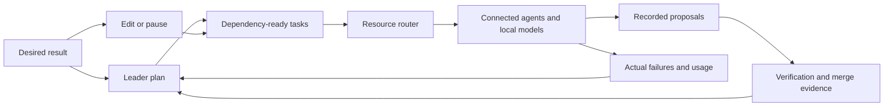

# Automatic work in Verse

Describe what you want to achieve. Verse chooses among connected resources and
keeps the result, work, and evidence together. You can guide a conversation in
**Work with me**, or steer a durable outcome in **Work for me**.

These flows use the existing chat and resident fleet harnesses. Saving an
outcome does not activate a dormant fleet or sign a standing grant. Check the
installed release and [resident setup](AUTONOMY-SETUP.md) before relying on
unattended execution.

## Work with me

Open **New chat**, choose a project, and describe the work. **Automatic** chooses
a connected account and model using task classification, resource availability,
and your preferences. Jev advice is used when configured; local classification
remains available when it is not. Account and model controls are under
**Advanced** for an explicit override.

Automatic can hand a later turn to a better suited resource before sending it.
Manual selections remain pinned. Local-only projects retain their local-only
boundary. A failed handoff preserves the draft; it does not send a duplicate
turn. Unknown project privacy is resolved before remote classification or work.

## Work for me

In Fleet, select **New outcome**. Enter the desired result, select enrolled
repositories, and describe how you will know it worked. The Leader refines a
plan through its existing planning cadence. Independent ready tasks enter the
same resident queue and resource router used by other fleet work.



Edit the outcome as your understanding changes. Unchanged tasks keep their
history through replanning; changed scope retires old tasks. Pause prevents new
requests and asks resident-owned running work to stop. External provider jobs
may continue until cancellation is confirmed. Resume uses current enrollment
and authority rather than the old permission snapshot.

Expand an outcome to see its tasks, selected run, controller run, proposal, and
verified merge identity. **Plan verified** means every active plan task has
verification or explicit gate evidence. Check the desired result against your
acceptance criteria; that label does not independently prove an arbitrary
product or business outcome.

## Evidence and recovery

Outcome revisions and task bindings are durable, private records. A replayed
command does not launch another producer. Parallel candidates register their
actual run identities before contact, and only the selected proposal can
complete their task. Completion uses the protected persisted proposal and
existing verification and authenticated merge checks.

Failures enter the Leader's corrective planning context. Interrupted work with
unknown provider effects stays unknown; missing receipts do not prove that no
work ran. An empty diff or a producer reporting success cannot complete a task.
Unavailable enrollment or damaged outcome records remain visibly unavailable.

There is no new goal-count or agent-count preference imposed by outcomes.
Each plan uses the existing mission graph transport, and plans can evolve over
time. Actual serving slots, provider quotas, account policy, workspace isolation,
and the operator's current authority still determine what can execute.

Long desired results remain intact in the saved scope and producer prompt.
The graph uses a host-bound scope reference when its existing objective field
cannot hold the text. This preserves the desired result without replacing it
with a model-written summary.

## Reproduce the checks

From a trusted source checkout:

```sh
npx vitest run test/outcome-core.test.ts test/outcome-runtime.test.ts test/outcome-dispatch.test.ts test/outcome-daemon-loop.test.ts test/leader-outcomes.test.ts test/outcomes-api.test.ts
npm run gate
```

The resident tick tests use real disposable outcome, Goal, and Inbox stores with
offline producer boundaries. They check replay, pause, mirror enrollment,
parallel winner identity, and authenticated receipt verification. They do not
claim a live provider run or a real GitHub merge. Provider boundary tests cover
post-await cancellation and conservative accounting for contacted requests.
Shipped Ollama and OpenAI-compatible adapters expose those boundaries; hidden
retries inside third-party clients require an adapter-owned request hook.

The gate reports checks and base/head changes and enforces the existing desktop
and phone first-paint byte budgets. Passing it is separate from npm publication,
native installation, phone pairing, and resident activation.
