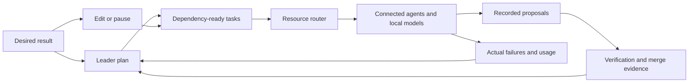

<a id="automatic-work-in-verse"></a>

# Automatic work in Phantom

Describe what you want to achieve. Phantom chooses among connected resources and
keeps the result, work, and evidence together. You can guide a conversation in
**Work with me**, or steer a durable outcome in **Work for me**.

These flows use the existing chat and resident fleet harnesses. Saving an
outcome does not activate a dormant fleet or sign a standing grant. Check the
installed release and [resident setup](AUTONOMY-SETUP.md) before relying on
unattended execution.

## Resources and routing

Bring supported signed-in CLI accounts, configured API resources and tool-capable
local models. They share a workbench, not a billing account: CLI subscriptions,
API charges, Devin ACUs and local hardware capacity retain their own limits.
Reported organization usage does not establish a personal subscription balance,
and unknown usage is not spare quota.

Automatic chooses among eligible resources using task fit, current capacity,
preferences, cost basis and observed latency when available. Configured Jev can
advise; admission checks still decide whether the resource can run. The fleet
can distribute independent ready tasks across admitted resources, subject to
serving slots, workspace isolation, quotas, reserves and current signed authority.
Devin fleet launches use a separate granted ACU-budget path.

**Manager** coordinates delegation and review for an explicit chat or outcome.
**Leader** refines fleet priorities, reads results and briefs you. The
successor source shares account-bound invocation across prepared Claude Code,
Codex, Grok, included native Devin models and local resources. Model choice
uses current capabilities and measurements rather than provider-specific roles.
These additions require the successor release; publication of 3.27.0 alone does
not activate them. Current capacity, account identity and signed roles decide
which resources can run.
Configured Telegram carries the same Leader conversation, short briefs, questions
and approval controls. A reply or directive does not widen your grant.

Muse is an opt-in metered API resource, not a Muse Code browser subscription.
Dots, Grok Bot and read-only OpenAI Agents inventory are separate companion
surfaces; listing them does not connect an execution seat.

## Work with me

Open **New chat**, choose a project, and describe the work. **Automatic** chooses
a connected account and model using task classification, resource availability,
and your preferences. Jev advice is used when configured; local classification
remains available when it is not. Account and model controls are under
**Advanced** for an explicit override.

Automatic can hand a later turn to a better suited resource before sending it.
Manual selections remain pinned. Local-only projects retain their local-only
boundary. A failed handoff preserves the draft; it does not send a duplicate
turn. Unknown project privacy is resolved before remote classification or work.

### One conversation with the Manager

In an existing chat, choose **Manager** in the **Auto seat** menu. **One
conversation; Phantom plans, delegates and reviews across your resources.**
Your project folders must each match one current enrolled repository. The
Manager uses the resident fleet; choosing it does not activate a dormant fleet
or authorize another account.

Messages are saved in this conversation before their references reach the
outcome. A confirmed send means **saved**, not launched or completed. You can
send guidance while a native turn runs; that turn continues separately. If a
response is uncertain, **Retry saved message** uses the original message
identity and preserves a newer draft. The status line shows actual planning,
review, queued, paused, failed, or unavailable state. **Pause manager** and
**Resume manager** update the existing outcome.

Finished Manager replies come from registered, persisted runs. Opening the
chat or its visible status poll recovers missing replies after a restart.
Expand **Manager · ‹model›** for the selected seat, run, stage, and complete
actual source; the technical result protocol stays folded by default. The
selected seat is routing provenance, not a separate billing-account receipt.

This initial mode accepts text and project files. Uploaded chat attachments
remain in your draft and require native routing. **Auto**, **Cheap-first**, and
**Auto off** retain their existing behavior; choosing Manager is explicit.
Switching routing modes does not pause an existing outcome; use **Pause
manager**. Work still needs actual proposal, verification, and merge evidence to
complete.

## Work for me

In Fleet, select **New outcome**. Enter the desired result, select enrolled
repositories, and describe how you will know it worked. The Leader refines a
plan through its existing planning cadence. Independent ready tasks enter the
same resident queue and resource router used by other fleet work.

Expand a saved outcome and select **Enable manager** to use the shared frontier
Manager for planning and review. Its status shows actual planning, reviewing,
replanning, waiting or failure; the recorded route names the selected engine and
model. Enablement uses your current outcome revision and existing fleet
authority. If a response is uncertain, retry preserves the original command;
**Use current manager revision** explicitly replaces a stale revision. Resume a
paused outcome before enabling its Manager. Existing chat-linked Managers keep
their conversation, and ordinary outcomes retain the Leader planning path.



Edit the outcome as your understanding changes. Unchanged tasks keep their
history through replanning; changed scope retires old tasks. Pause prevents new
requests and asks resident-owned running work to stop. External provider jobs
may continue until cancellation is confirmed. Resume uses current enrollment
and authority rather than the old permission snapshot.

Expand an outcome to see its tasks, selected run, controller run, proposal, and
verified merge identity. **Plan verified** means every active plan task has
verification or explicit gate evidence. Check the desired result against your
acceptance criteria; that label does not independently prove an arbitrary
product or business outcome.

## Read the result, not just the status

Use **Resources** for separate chat and fleet readiness, dated usage and available
reset readings. Expand a turn's tools and context for reported actions and source
evidence; open changes and verification results to judge the work. Traces show
what the harness recorded, not every internal thought. Timing and usage may be
measured, estimated or unknown; missing readings are not zero.

A running worker is progress, not delivery. Recorded proposals, verification and
merge evidence answer different questions. Compare the actual result with your
acceptance criteria before treating an outcome as complete. Failures and holds
remain visible and feed the existing corrective planning path.

[Phantom Secrets](https://github.com/ashlrai/phantom-secrets) manages credentials.
Configured local-token/proxy paths can keep real keys out of agent context;
in-process API adapters can still reveal a key for a call. Configured
[Locus](https://github.com/ashlrai/locus) checks account/session identity with
explicit off, warn, enforce or firm behavior. Neither tool's presence proves
all resources are activated or every call has the same credential boundary.

## Evidence and recovery

### Task context in the successor source

Each saved task has a stable `id`. The authenticated read endpoint
`GET /api/verse/outcomes/:outcomeId/tasks/:taskId/context` retrieves its saved
definition, exact-attempt action receipts and authorized private task records.
It checks the current outcome and enrolled repositories, runs filesystem reads
off the desktop server's event loop, and creates no records during retrieval.

Evidence retains its provider, account, object, revision and original source
references. `occurredAt` and `observedAt` answer different questions: when the
event happened and when Phantom observed it. Unknown event times remain `null`.
Optional `asOf` and `observedThrough` parameters require explicit timezone
offsets. `maxEvents` controls retrieval size; truncation remains visible in
`coverage.complete` and `coverage.stopReasons`.

Current and historical evidence retain superseded, canceled and expired states.
Conflicting revisions remain visible instead of choosing whichever arrived last.
Private content stays out of action telemetry. This first endpoint includes
local Phantom evidence only. It does not import Gmail, calendars or global firm
memory, or establish a connection to a personal proactive agent. Those sources
need a qualified account-specific adapter. Missing and partial sources remain
unknown; a dispatch receipt does not prove completion.

Connected engineering agents can retrieve the same evidence with the read-only
native MCP tool `phm_task_context`, using the saved `outcomeId` and task `id`.
The tool validates the same scope and remains readable while work is stopped.

Outcome revisions and task bindings are durable, private records. A replayed
command does not launch another producer. Parallel candidates register their
actual run identities before contact, and only the selected proposal can
complete their task. Completion uses the protected persisted proposal and
existing verification and authenticated merge checks.

Failures enter the Leader's corrective planning context. Interrupted work with
unknown provider effects stays unknown; missing receipts do not prove that no
work ran. An empty diff or a producer reporting success cannot complete a task.
Unavailable enrollment or damaged outcome records remain visibly unavailable.

The Leader checks the saved graph after planning. A memo that omits a needed
plan, or whose refinement is refused, does not count as planning progress.
Retries follow the existing backoff for the current saved scope; editing the
scope permits a fresh attempt. Daily and manual runs retain their recovery
path. Advisory memos cannot stand in for saved executable work.

There is no new goal-count or agent-count preference imposed by outcomes.
Each plan uses the existing mission graph transport, and plans can evolve over
time. Actual serving slots, provider quotas, account policy, workspace isolation,
and the operator's current authority still determine what can execute.

Fleet count preferences can be **Automatic**, with no operator count ceiling,
or an explicit number. In Budget and limits, **Use Automatic counts** applies
Automatic to items per tick, batch parallelism, continuous concurrency, and the
local, cloud and total tiers. Existing numeric preferences stay in effect until
you change them. Automatic derives worker counts from available work and actual
resource admission; remaining work continues through the durable queue. Money,
subscription reserves, purchased-credit policy and signed authority retain
their separate settings.

Long desired results remain intact in the saved scope and producer prompt.
The graph uses a host-bound scope reference when its existing objective field
cannot hold the text. This preserves the desired result without replacing it
with a model-written summary.

## Reproduce the checks

From a trusted source checkout:

```sh
npx vitest run test/outcome-core.test.ts test/outcome-runtime.test.ts test/outcome-dispatch.test.ts test/outcome-daemon-loop.test.ts test/leader-outcomes.test.ts test/outcomes-api.test.ts
npx vitest run test/m116.worker-pool.test.ts test/m255.concurrent-dispatch.test.ts test/m344.production-velocity.test.ts test/verse-caps.test.ts test/verse-control-api.test.ts
npm run gate
```

The resident tick tests use real disposable outcome, Goal, and Inbox stores with
offline producer boundaries. They check replay, pause, mirror enrollment,
parallel winner identity, and authenticated receipt verification. They do not
claim a live provider run or a real GitHub merge. Provider boundary tests cover
post-await cancellation and conservative accounting for contacted requests.
Shipped Ollama and OpenAI-compatible adapters expose those boundaries; hidden
retries inside third-party clients require an adapter-owned request hook.

The gate reports checks and base/head changes and enforces the existing desktop
and phone first-paint byte budgets. Passing it is separate from npm publication,
native installation, phone pairing, and resident activation.
