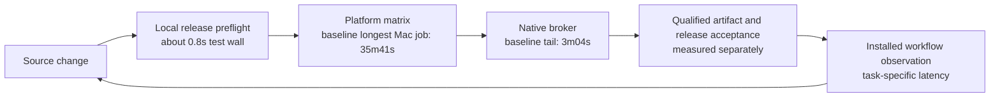

# Phantom efficiency roadmap

## Current measurements and next experiment: 2026-10-10

The 3.29.9 source candidate includes three independent performance changes.
These are local measurements and a scheduling experiment, not published or
installed performance claims.

| Change | Observation | Scope |
|---|---|---|
| Defer onboarding imports until CLI dispatch | Compiled Node help, version and resource-help startup fell from 117–118 ms to 32–33 ms. | Five alternating fresh-process baseline/head pairs per command on macOS with Node 22.23.2; warm transform cache. Outputs and exit statuses matched. Installed native startup remains unmeasured. |
| Lightweight worker mock setup | Median local wall time fell from 4.173 s to 3.911 s; reported setup time fell from 427 ms to 71 ms. | Three serial baseline/head pairs over the same five modules and 120 cases with Node 22.22.3 and Vitest 4.1.11. Full-suite gains remain unmeasured. |
| Load only the selected package smoke command | Local module wall time fell from 60.02 s to 56.40 s, about 6%. | One serial baseline/head pair with Node 22.23.2 on macOS. Both fresh compiled graphs and all 38 cases passed with identical case identities and statuses. Hosted gains remain unmeasured. |
| Overlap short Mac checks with general lanes | Both short jobs become eligible after the isolated lane settles. | All 15 release gates, test membership, fixtures, deadlines and cache identities remain required. Runner contention can offset overlap; no hosted gain has been measured. |

[CI run 38032235502](https://github.com/ashlrai/phantom/actions/runs/38032235502)
passed all 15 jobs at `cc49a266ca5a94bd7ef4ab78df45178eb2613a88`.
Its elapsed time was 54m41s. One general Mac lane waited 19m07s for a runner;
the final short Mac gate added 4m43s after the exhaustive lanes finished.
The isolated lane finished 19m56s before the last general lane. These timings
motivate the overlap experiment; they do not predict a guaranteed speedup.
This historical run is not qualification of a later source revision.

Compare natural hosted runs after the experiment, recording queue time and
execution time separately. Reuse the original qualified build for publication
and installation; avoid rebuilding it simply to move it between release stages.

## Earlier release feedback: 2026-10-08

The 3.25.3 candidate runs nine whole modules through the existing
`npm run check:release` preflight before the producer build. Resident-service
documentation and release-workflow contracts now join the seven existing modules;
these caught stale link-label and legacy tag-filter expectations during this release.
The local run passed 140 cases with one existing platform skip in 5.20 seconds.
This is local feedback time, not total hosted CI or release time.

The required native library lane also tests the real updater HTTP client in a fresh
process. Moving its two cases from the binary suite preserves 371 passing cases
and four existing ignores across both suites. Every platform job, full qualification,
Audit, original-artifact verification and installed startup check remains required.
Publication and installed acceptance of this candidate are still pending.

## Measured engineering efficiency: 2026-10-07

Optimize time to verified working software, preserving supported-platform
coverage and exact release evidence. This review separates elapsed critical-path
time, aggregate runner consumption, fixture time and decision latency. They are
different measurements; improving one does not prove a gain in the others.

### Completed CI baseline

[CI run 37570690824, attempt 1](https://github.com/ashlrai/ashlr-hub/actions/runs/37570690824)
completed all 15 jobs successfully at source
`e254d290787890165b2f31b9cf86e9ebdd1c638d`, tree
`4ca687d0681418d34fc4851901c76148f23a5d49`, on 2026-10-07.
The observation covers 04:16:39–04:55:43 UTC. It is a historical foundation
baseline, not acceptance of the current candidate.

| Measurement | Observed value | Scope and implication |
|---|---:|---|
| Full CI elapsed time | 39m04s | Includes queue offsets and the native job after Mac qualification. |
| Longest general Mac job | 35m41s | General shard 3; its Vitest wall was 2,009.95s. |
| General shard 3 fixture time | 1,817.60s / 90.4% | Reported tests dominate; transform was 34.46s, setup 45.89s and imports 105.76s. |
| Isolated Mac qualification wall | 30m19s | The complete isolated job was 31m40s. |
| Isolated fixture time | 1,765.10s / 97.7% | Fraction of 1,807.07s of Vitest invocations, not of the whole CI run. |
| Native broker tail | 3m04s | Runs after all five Mac jobs; it limits gains from faster general shards. |
| 14 normal builds | 1,047 runner-seconds | Aggregate resource use, not 17m27s of elapsed critical-path time; the longest critical Mac build was 88s. |

Timing categories can overlap, and test hooks are not fully attributable to
individual cases. The Mac and Linux reports covered the same 1,473 distinct
backend module paths, but platform skips and actual native checks differ. Equal
file membership does not make those executions interchangeable. Whole-project
types, lint and docs already run once in the shared Ubuntu job; other platform
builds provide their compiled CLI and runtime inventory. See the
[CI workflow](../.github/workflows/ci.yml),
[whole-module sharding harness](../scripts/test-ci-sharded.mjs) and
[artifact qualification contract](../scripts/hosted-build-artifact.mjs).

The arrows show feedback order, not additive timing segments. The 0.8s local
check is from a later source than the hosted baseline; it excludes dependency
installation and does not replace the full matrix, Audit or release acceptance.

### Narrow improvements in the 3.24.4 candidate

At the historical review below, the installed and published release was **3.24.3**.
The following work is source-qualified in the **3.24.4 candidate** at
`022e024dbf9b6d25d27c56ac9d72ccddae9acfb5`; it has not yet established
installed, published or production performance improvements.

| Improvement | Verified behavior | Evidence boundary |
|---|---|---|
| Parallel MCP discovery | Independent downstream tool lists start together and merge in configured order; existing routing and error isolation remain. | Five whole modules passed, 121 cases, including a baseline-failing rendezvous regression. No universal discovery speedup or live-provider latency claim. [Gateway source](../src/core/mcp-gateway.ts), [regression coverage](../test/mcp-gateway-discovery.test.ts). |
| Jev response-time chart | Shows per-kind daily mean decision wall time and recorded call counts; excludes cache hits and counts one call per batch. Zero, no calls and unknown remain distinct. | Four whole UI modules passed, 40 cases, with a synthetic 390px keyboard-table preview. It measures request and decision processing, not model decode speed, quality, percentiles or tokens per second. [Chart](../src/web-ui/routes/verse/jev/JevLatencyChart.tsx), [ledger](../src/core/decide/ledger.ts). |
| Local release preflight | `npm run check:release` invokes the existing three whole publication and source-contract modules before an expensive build or push. | 64 passed, one intentional platform skip, about 0.8s test wall on the qualified local source. Dependency setup, build and hosted job startup are separate. [Local release guide](RELEASING-LOCALLY.md), [script](../package.json). |

### Prioritized remaining work

1. **Reject cheap release failures before expensive CI starts.** Keep the shared
   read-only hosted release preflight before the producer build. Preserve all
   15 platform jobs, exhaustive test membership, existing
   deadlines, producer capture and protected-master attestation. Measure failed
   iteration time saved and successful-run startup overhead separately.
2. **Profile the real fixture hot spans.** The longest observed modules were
   setup acceptance (540.40s), mission acceptance (410.64s) and universe delivery
   (243.06s). Measure preparation, receipt validation, child startup and
   filesystem waits before changing caching. Retain real restart, drift, Stop
   and delivery behavior; do not replace integration coverage with mocks.
3. **Balance whole modules using observed duration.** A historical simulation
   of the four general Mac shards retained membership and modeled about 98s of
   critical-path improvement with observed queue offsets. This is not an
   achieved result; the isolated lane and native tail remain. Any new partition
   contract needs separate review, deterministic fallback for new files, exact
   union checks and unchanged isolation and platform requirements.
4. **Join tool and model measurements to outcomes.** Use the
   [agent efficiency guide](ELITE-AGENT-EFFICIENCY.md) and
   [local report comparison](ELITE-AGENT-EFFICIENCY.md#compare-recorded-local-usage)
   for controlled source, task, model, concurrency and cache provenance.
   Browser/terminal/tool latency, cold startup, local-model decode speed and
   routing cost need their own compatible before/after observations. Missing
   counters stay unknown; a daily Jev mean cannot establish those measurements.

For each optimization, pin baseline and head source/tree, OS and Node,
whole-module and occurrence-aware case membership, pass/skip/todo counts,
fixture/transform/setup/import counters, queue offsets, runner consumption and
native tail. Compare natural runs at unchanged deadlines, retain actual failures
and separately verify packaging, publication, installation and user acceptance.
There is no measured 95–99% full-pipeline improvement. Faster framework startup
alone would not remove the observed fixture work.

## Historical ecosystem consolidation proposal: 2026-06-28

The estimates below are the original proposal, not measured current costs,
completed migrations or delivered savings. Revalidate account, dependency and
product boundaries before selecting this work.

> The ecosystem should be a **platform, not 13 silos.** Each repo separately
> reinventing + paying for the same foundation (Supabase, auth, billing,
> telemetry, MCP boilerplate, cost-tracking) is the core inefficiency. The
> efficient + more *powerful* end-state is a shared platform layer the fleet
> builds + maintains, so the whole ecosystem compounds: each shared package
> makes the next product faster, and one identity makes the tools interoperate.
> Synthesized 2026-06-28 from two parallel ecosystem audits. Dollar savings are
> modest; the real prize is velocity + coherence. Feeds the strategist + invent.

## Ideal end-state
- **One shared infra layer** — one Supabase (schema-per-product), one auth/SSO, one telemetry sink (pulse), one billing account. Managed by **stack**.
- **One shared code layer** — `@ashlr/*` packages (core-efficiency exists; add mcp-kit, cost, auth, config, cli-common). DRY foundation every product builds on.
- **One agent surface** — a unified MCP gateway (workbench already aggregates; generalize).
- **One pane of glass** — pulse (telemetry + fleet dashboard), phantom (the one secret store).
- The **fleet** extends + maintains all of it, frontier-efficiently (core-efficiency applied to itself, best-of-N tuned to high-value items, M194 usage dashboard keeping spend visible).

## A. Infrastructure consolidation (cost + coherence)
| Move | Repos | Risk | Saves | Notes |
|---|---|---|---|---|
| **SendGrid → one account** | pulse, binshield, prompt-trackr, webfetch, plugin | LOW | ~$10–20/mo | Quick win. Per-product sender domains, one API key (in phantom). |
| **Supabase → shared project** | **binshield + prompt-trackr** | LOW | ~$25–50/mo | Both SaaS+subscriptions; schema-prefix (`binshield_*`, `prompt_trackr_*`) + RLS isolation. **Keep pulse/morphkit isolated** (distinct needs); stack is a provisioner, not a consumer. |
| **Stripe → one account** | binshield, prompt-trackr, morphkit, pulse, webfetch | MED | ~$50–100/mo | Central pricing-config ({product,tier}→price_id) + one webhook router (ashlr-hub) dispatching by product; webhook secrets stay per-repo in phantom. |
| **Auth → shared OIDC/SSO** | (Supabase repos already; plugin/webfetch opt-in) | LOW | ops | One identity across the suite — a *product* upgrade, not just savings. |
| **Hosting** | — | — | — | **Do NOT consolidate** — Vercel/Workers/Edge are specialized. |
First-pass: **~$85–170/mo, ~11–16 days, phased over 2–3 months.**

## B. Shared `@ashlr/*` packages (velocity — the bigger lever)
| Package | Replaces duplication in | Tier | Payoff |
|---|---|---|---|
| **@ashlr/mcp-kit** | plugin, hub, webfetch, prompt-trackr (MCP server boilerplate, tool registry, transports, error shapes) | 1 | ~40% boilerplate cut across 4 repos |
| **@ashlr/cost** | ashlrcode (254-line CostTracker), plugin (_pricing.ts), core-efficiency (tokens) — unify pricing for all providers | 1 | kills duplication + **cuts the fleet's own cost-tracking** |
| **@ashlr/auth** | plugin, ashlrcode, webfetch, hub (AES-GCM crypto, PKCE OAuth, session/Bearer middleware) | 2 | one auditable auth layer (mind master-key rotation) |
| **@ashlr/config** | plugin, hub, ashlrcode, stack (config loaders + phantom integration) | 2 | standard config + secrets; promote phantom adoption (ashlrcode stores tokens in plaintext today → should use phantom) |
| **@ashlr/cli-common** | ashlrcode, morphkit, hub, binshield (help/flags/spinners) | 3 | consistent CLI UX |
Existing **@ashlr/core-efficiency** should be adopted by **ashlrcode** (it reimplements token counting).

## Fleet-executable vs your-hands
- **Fleet can do autonomously (code/config/PRs):** extract the `@ashlr/*` packages, refactor repos to consume them, the pricing-config + webhook-router code, env/schema-prefix code changes, adoption of phantom/core-efficiency.
- **Needs your hands (account/billing/live-data):** the actual Supabase-project merge + data migration, Stripe account consolidation + billing, SendGrid account, DNS/sender domains. The fleet preps the code + a migration plan; you flip the account-level switches.

## Recommended order
1. **@ashlr/mcp-kit + @ashlr/cost** (Tier-1 shared packages — pure code, fleet-executable now, immediate velocity + cuts the fleet's own cost)
2. **SendGrid consolidation** (quick infra win)
3. **@ashlr/auth + @ashlr/config** (Tier-2 packages)
4. **Supabase (binshield+prompt-trackr) + Stripe** (infra; fleet preps, you migrate)
5. **@ashlr/cli-common + unified MCP gateway** (consistency)

This roadmap is itself high-value fleet work — the `@ashlr/*` extractions are exactly the substantive, compositional work the generative engine should propose + build. See [[ecosystem-map]] · docs/ECOSYSTEM-MAP.md.
