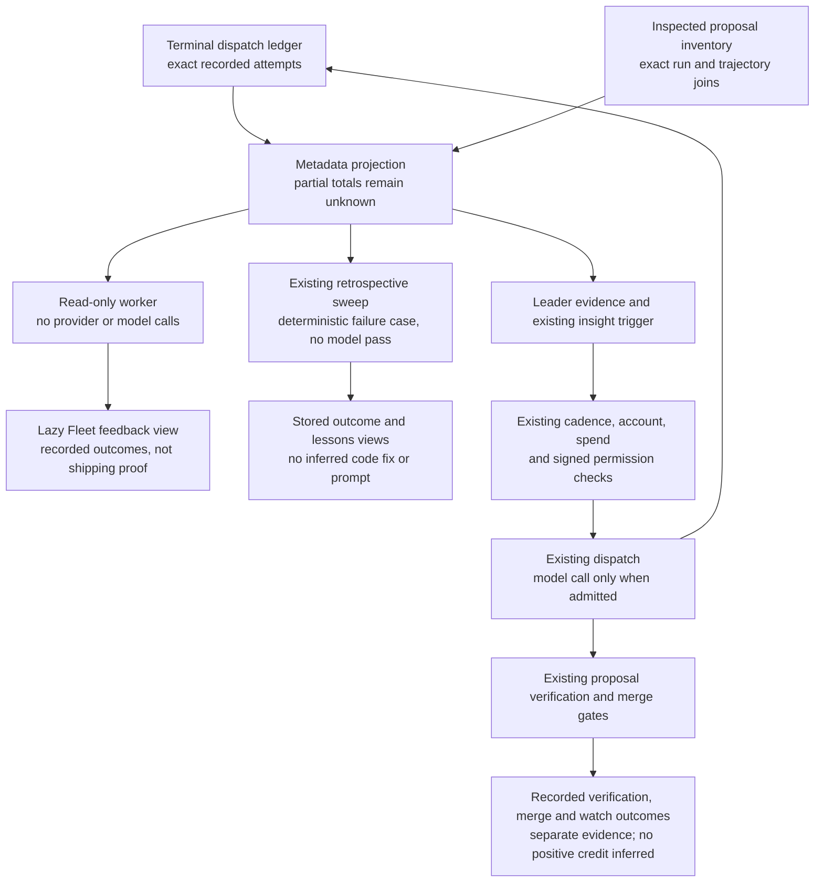

# Recorded fleet execution feedback

Execution feedback connects terminal producer records to the existing retrospective sweep and Leader evidence. Reading it runs no provider, model, repair, or dispatch. It does not change permissions, spend, account readiness, or routing credit.

The projection separates proposal production, producer failure, cancellation, refusal, empty diff, disabled proposal filing, and unknown outcome. A produced proposal is **not** a verified change, merge, successful deployment, or beneficial production outcome. Those stages remain recorded by their existing proposal and authority readers.

Only current writer envelopes with matching attempt, run, trajectory, outcome, and summary count. Identical replays count once. Conflicting finals for the same attempt are withheld rather than resolved by arrival order. Legacy envelopes, unreadable files, truncated reads, and invalid or future timestamps make exact totals unknown. `observedCounts` remains a qualified lower bound; a missing store is not a measured zero.

The metadata view contains opaque case hashes and finite outcome fields. Raw prompts, errors, repository paths, account identities, run IDs, and tool payloads are excluded. Authorized internal callers can resolve a case through `lookupExecutionFeedback` to its real run and attempt trajectory. This is recorded local correlation, not signed authority or proof of provider identity.

The retrospective sweep records an observed engine, sandbox, or capture failure only when no proposal was recorded and the proposal inventory was completely inspected. A late proposal must match **both** run and attempt trajectory to suppress this no-proposal learning path. Partial proposal reads hold it. An already saved failure remains a historical observation; distinct later verification or merge outcomes retain their own records.

These failure retros contain no inferred code or authentication diagnosis, no sharper prompt, and no knowledge candidates. They skip the optional model and Jev refinement passes. The existing stable retrospective ID, sweep single-flight, private storage, retention, and review flow handle replay and persistence.

The Leader receives aggregate metadata as untrusted evidence. Failed attempts after its last run can use the existing insight trigger. Daily preferences, retries, hash coalescing, signed authority, account and spend admission still apply. Trigger and prompt collection share one bounded read in a tick; source failure remains unknown. No separate paid wake-up is added.

The worker reader uses a fixed seven-day window and existing bounded inspection-only dispatch/inbox readers. A retrospective sweep uses its existing thirty-day window. Coverage reflects those windows and reader byte/file/row limits; it does not claim whole-history completeness. Usage, tokens, duration, causal repair success, and positive post-merge credit are not synthesized by this projection.

Opening the view does not traverse the dispatch path. The Leader may use recorded evidence in an already permitted run; neither a retrospective nor an observed failure bypasses admission or proves that a repair worked.
