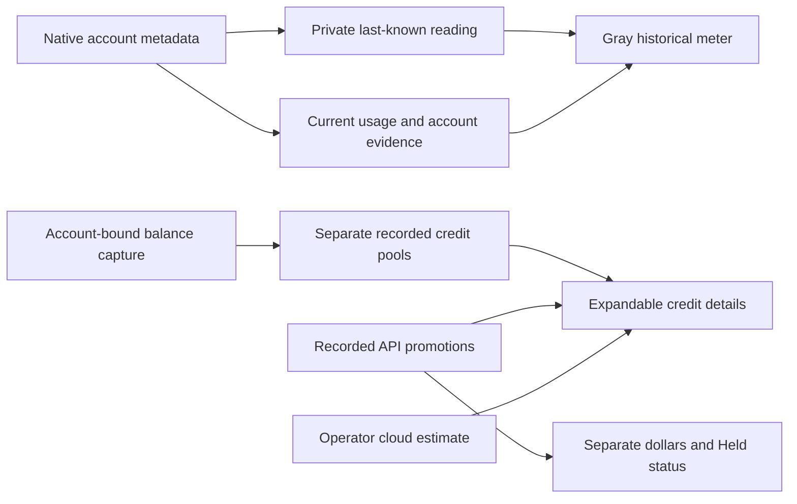

# Resource readings and credit balances

Phantom keeps each account's subscription windows, native credit units, captured dollar balances, and operator estimates separate. The resource sidebar uses the same live capacity model as the resource drawer. Refreshing a reading does not renew its original observation or expiration.

Summary counts describe accounts **with current usage** and accounts whose usage is
**unconfirmed**. A fresh reached-limit reading still counts as current evidence;
it does not imply available allowance. Sign-in, recorded credits and historical
readings alone do not count as current usage. Chat and Fleet readiness appear
separately in each account card.

Connect native CLI accounts for subscription work, configure API resources separately,
or run models on your own hardware. Routing is provider-neutral: an account's
supported execution path, model capabilities and current evidence determine which
roles it can run. A company name alone does not qualify a Leader, Manager or worker.
See [work modes and routing](AUTOMATIC-OUTCOMES.md).

On startup, a validated private reading cache can show last-known usage before native metadata collection completes. Gray meters say **last** and retain the original reading date. Fresh native readings replace them. Historical windows never supply live capacity, account authentication, usable-again times, routing eligibility, or reset spend-down pressure. An account switch or sign-out suppresses the previous account's values.

The private cache binds readings to the account, selected native profile, and a checked local identity. An unchanged local credential-file epoch can qualify historical association after restart; it does not prove a current provider login. Original timestamps remain unchanged. Bulk cache writes and file synchronization run asynchronously. The final ownership, account-generation, target-file, and temporary-file checks precede a short metadata commit without an intervening JavaScript yield. Files remain private, and a malformed or replaced cache is unavailable rather than silently overwritten.

## Different kinds of capacity

| Reading | Display | Meaning for autonomous scheduling |
| --- | --- | --- |
| Current subscription window | Native percentage and reported reset | Existing account, permission, and subscription admission apply |
| Historical subscription window | Gray dated reading | Display only; does not authorize work |
| Native Codex credit balance | Rounded recorded credit units and a labeled dollar reference when supported | Separate from the subscription; a balance does not authorize autonomous credit spending |
| Captured Claude cloud gift | Rounded last-recorded dollars, cloud scope, and verified expiration if recorded | Historical balance evidence; capture does not activate gift spending |
| Captured purchased usage credits | Separate last-recorded dollars and expiration, if known | Does not acquire subscription reset urgency |
| Captured Claude API promotion | Separate recorded API dollars and verified date precision | Advisory only; billing, execution binding and signed API authority must be commissioned before spending |
| Operator cloud estimate | **Cloud estimate**, with its estimate qualifier | Separate from a provider-reported wallet or captured balance |
| Local model | Runtime readiness, host CPU/RAM and scoped speed readings | Uses this computer's hardware, not a provider subscription allowance |
| Grok Bot profile | Separate identity; unknown allowance and reset until verified | Grok Build quota does not establish Bot capacity or connect Bot execution |

Dollar references are not invoices, purchased-credit prices, or attributed task costs. Subscription percentages are not token counts. Different accounts remain independent, including accounts from the same provider. No account-count truncation is introduced by these views.

## Grok Build and Grok Bot

Grok Build's native account reading, Grok Bot's included allowance and xAI API
credits are separate resources. The native CLI reports a consumer billing
window and reset, which can be Build-specific or shared across supported
consumer use. Usage labels distinguish these scopes and their reported weekly
or monthly periods. Phantom does not copy the observation into a Bot profile
or API wallet.

[Grok Bot's included usage](https://cursor.com/help/grok-bot/plans) has a weekly
meter on the linked Cursor account. On-demand usage is a separate paid pool;
its monthly spending limit is not a hard stop during an active run. A linked
SuperGrok plan grants Bot access without stacking another allowance on top of
an existing eligible Cursor plan.

Current proactive profiles record the intended Bot account and responsibilities,
not a verified remaining allowance or reset. Phantom has not qualified a native
Bot quota reader or autonomous Bot dispatch. Unknown Bot usage stays unknown;
saving a profile never enables spending. See [proactive profiles](VERSE.md#proactive-agent-profiles).

Track each account and product independently. Build allowance cannot substitute
for Bot allowance, even when one subscription gives access to both. Purchased
credits and Bot on-demand billing are not included allowance to spend before a reset.

## Local hardware and task speed

Expand the local resource to inspect host CPU, RAM, runtime-reported model
residency and recorded task speed. These measurements have different meanings:

The fleet also uses complete, fresh runtime slot activity to size new local
work. Total serving capacity and currently available slots are separate facts.
Existing experiment reservations and observed occupancy are counted once;
new experiments reserve their slots after the observation. Unknown or stale
activity retains the existing configured-capacity policy. CPU, RAM and warm
decoder speed do not impose additional routing limits.

- **Host CPU** is busy time across all cores over the displayed sampling interval.
  It averages activity since the previous sample. The first reading after the
  drawer was closed or the window hidden can span that entire gap; visible
  polling normally samples every 30 seconds. RAM is sampled at the new reading,
  rather than averaged over the CPU interval.
- **Host RAM** is total and OS free memory. Free memory is not macOS memory
  pressure or a safe model-allocation limit; model residency is reported separately.
- **Task speed** is recorded output tokens divided by end-to-end turn time,
  bound to the selected resource, model, context and endpoint. It includes tool
  and harness time; it is not decoder speed. Failed or cancelled turns do not
  become successful speed observations. Warm measurements retain their warm scope.

Input, output, cache-read and cache-write counts each require explicitly reported,
valid token evidence. Missing fields and older events without that evidence stay
unknown; a normalized zero does not prove zero usage. A turn can report output
tokens while its input or cache counts remain unknown. Only qualified output
counts and a completed turn duration establish its end-to-end token rate.

Missing measurements remain unknown, and visible ages retain the original
observation time. The router uses reported allowance, task/context fit, qualified
funding and explicit preferences. Unqualified provider-wide latency remains
diagnostic. Sidebar CPU, RAM and exact-model task-speed readings are currently
descriptive; they do not yet drive model selection or concurrency.

Context windows also carry provenance: a server-reported allocation, model
catalog value and configured/default estimate are different evidence. Inspect
the context tooltip and [context guide](VERSE-CONTEXT.md), rather than treating
every displayed window as a current per-agent allocation. Total serving context
and per-slot context are distinct.

## Routing tiers and roles

Elite, Fast and Free remain legacy display groups, not measurements of model
quality, speed or price. Default shared seat selection, Leader model-variant
selection and the chat Auto adviser do not use inferred provider or model-family
tiers as quality or cost ranks. They rank eligible resources by current headroom
and independent funding category, preserving configured runnable model order
when the evidence ties. Unknown quality and comparable latency stay unknown;
an unspecified funding category is neutral, not a zero-dollar cost.

Explicit model selections, pins and recorded operator preferences remain distinct
from catalog labels. A caller can supply an explicit invocation tier preference;
automatic catalog metadata does not create one. Provider-wide ship rates and
latency averages remain diagnostics, rather than exact account/model/task
measurements. A Devin SWE name does not prove included funding. Account-bound
native pricing and execution checks still apply.

Local coding dispatch binds the observed local seat to a tool-capable runtime,
such as llama-server or local-coder. The builtin planning loop cannot consume
that coding lane; if no capable local adapter is available, another eligible
account can run the work. Otherwise, the item waits.

This scope does not replace every legacy worker selection policy or establish
measured-quality learning. See the shared [seat router](../src/core/routing/router.ts)
and [Auto adviser](../src/core/verse/multimodel/advisor.ts).

Leader, Manager and worker eligibility is checked separately through the
available account-bound adapter, context, current funding evidence and authority.
Supported Claude, Codex, Grok, Devin and tool-capable local resources can serve
eligible roles; a saved connection or tier label alone does not qualify a run.

## Credit details

The visible resource bar and the open **Credit balances** disclosure share one recorded-balance query cache. The bar shows API promotion records separately from subscription meters; the disclosure shows each pool in detail. The authorized GET is `/api/verse/resources/credit-pools`; it accepts no query parameters, provider command, file path, or caller-selected identity. A cold request returns `warming` while the existing bounded worker reads private evidence. Stale and unavailable readings retain their qualifiers. The HTTP fast path uses existing in-memory collector status and identity snapshots.

Credit records project only their account ID, pool kind, exact amount, original capture time, scope, source, and expiration. Private identity digests, credential paths, and collection generations do not enter the response. Native account evidence verifies the association, not a manually captured monetary balance. Internal capture requires paired fresh native witnesses and a matching generation at publication. A changed or unknown identity hides the amounts. This read surface neither captures new balances nor changes provider billing.

The endpoint reads fixed local stores. Opening it does not start a model, provider probe, cloud scheduler, or dispatch. Missing records mean **unknown**, not zero dollars. A recorded deadline passing does not establish a newly refreshed balance or prove that a provider actually expired a grant.

## Claude API promotional grants

The resource bar and expandable credit view can show a private, verified API grant observation separately from Claude's subscription and cloud-session credits. A single promotion shows last-recorded dollars and **Held**; several records show their count without adding possibly overlapping history. On a cold local read, the bar checks every two seconds for at most thirty seconds, then returns to its regular fifteen-second cadence. Hidden surfaces stop polling. Money is stored as exact integer microdollars and displayed with two significant figures, including the recorded amount in hover details. Storage and admission arithmetic retain the exact values. Its asynchronous local read does not wait for the subscription worker or request billing credentials. API organization, workspace and credential digests remain private. Windows currently reports this new read unavailable until asynchronous private-file ACL verification is supported.

A provider-reported UTC expiry date is displayed as a date. When no exact expiry instant is supplied, Phantom conservatively stops new admissions at the **start** of that UTC date. This is Phantom's policy, not a claim about the provider's expiration time. Unknown balances or dates block admission. A future billing cycle never creates a synthetic new grant.

The internal first-party Messages adapter requires fresh verified prepaid, non-invoiced, promotion-only funding with auto-reload off, no purchased or other paid funding, a matching execution credential binding, and explicit signed metered authority. Each request reserves a bounded worst-case dollar amount before credential resolution or contact. Unconfirmed contact retains its reservation; only verified usage settles actual cost. It neither creates credentials nor changes billing.

The existing subscription standing grant does **not** enable this distinct API lane. The router keeps it off, and this read-only view says **Automatic use held** until the native authority and source-owned billing proof reader are commissioned. Manually recording a grant cannot enable it. See [reset-aware scheduling](RESET-AWARE-SCHEDULING.md#api-promotions).

For recorded attempt, verification, and GitHub outcomes, see [execution feedback](EXECUTION-FEEDBACK.md).
