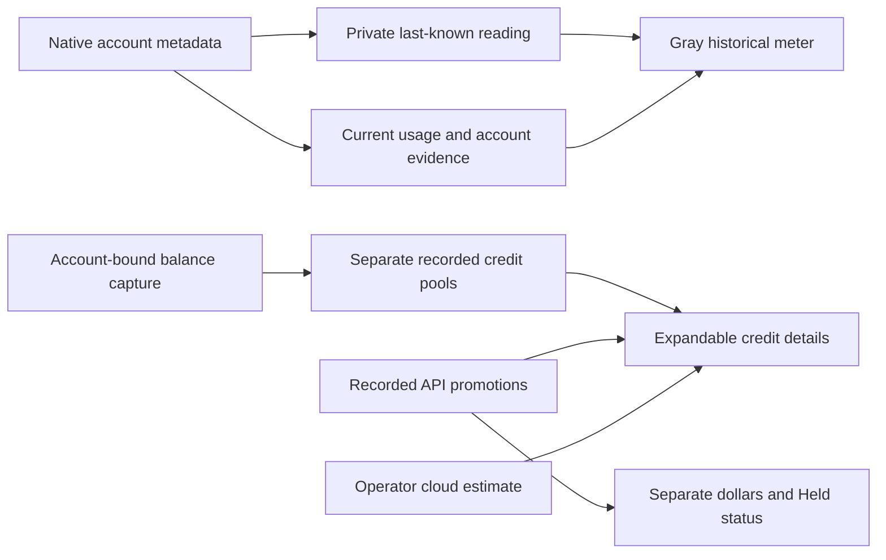

# Resource readings and credit balances

Phantom keeps each account's subscription windows, native credit units, captured dollar balances, and operator estimates separate. The resource sidebar uses the same live capacity model as the resource drawer. Refreshing a reading does not renew its original observation or expiration.

On startup, a validated private reading cache can show last-known usage before native metadata collection completes. Gray meters say **last** and retain the original reading date. Fresh native readings replace them. Historical windows never supply live capacity, account authentication, usable-again times, routing eligibility, or reset spend-down pressure. An account switch or sign-out suppresses the previous account's values.

The private cache binds readings to the account, selected native profile, and a checked local identity. An unchanged local credential-file epoch can qualify historical association after restart; it does not prove a current provider login. Original timestamps remain unchanged. Bulk cache writes and file synchronization run asynchronously. The final ownership, account-generation, target-file, and temporary-file checks precede a short metadata commit without an intervening JavaScript yield. Files remain private, and a malformed or replaced cache is unavailable rather than silently overwritten.

## Different kinds of capacity

| Reading | Display | Meaning for autonomous scheduling |
| --- | --- | --- |
| Current subscription window | Native percentage and reported reset | Existing account, permission, and subscription admission apply |
| Historical subscription window | Gray dated reading | Display only; does not authorize work |
| Native Codex credit balance | Exact credit units and a labeled dollar reference when supported | Separate from the subscription; a balance does not authorize autonomous credit spending |
| Captured Claude cloud gift | Exact last-recorded dollars, cloud scope, and verified expiration if recorded | Historical balance evidence; capture does not activate gift spending |
| Captured purchased usage credits | Separate last-recorded dollars and expiration, if known | Does not acquire subscription reset urgency |
| Captured Claude API promotion | Separate recorded API dollars and verified date precision | Advisory only; billing, execution binding and signed API authority must be commissioned before spending |
| Operator cloud estimate | **Cloud estimate**, with its estimate qualifier | Separate from a provider-reported wallet or captured balance |

Dollar references are not invoices, purchased-credit prices, or attributed task costs. Subscription percentages are not token counts. Different accounts remain independent, including accounts from the same provider. No account-count truncation is introduced by these views.

## Credit details

The visible resource bar and the open **Credit balances** disclosure share one recorded-balance query cache. The bar shows API promotion records separately from subscription meters; the disclosure shows each pool in detail. The authorized GET is `/api/verse/resources/credit-pools`; it accepts no query parameters, provider command, file path, or caller-selected identity. A cold request returns `warming` while the existing bounded worker reads private evidence. Stale and unavailable readings retain their qualifiers. The HTTP fast path uses existing in-memory collector status and identity snapshots.

Credit records project only their account ID, pool kind, exact amount, original capture time, scope, source, and expiration. Private identity digests, credential paths, and collection generations do not enter the response. Native account evidence verifies the association, not a manually captured monetary balance. Internal capture requires paired fresh native witnesses and a matching generation at publication. A changed or unknown identity hides the amounts. This read surface neither captures new balances nor changes provider billing.

The endpoint reads fixed local stores. Opening it does not start a model, provider probe, cloud scheduler, or dispatch. Missing records mean **unknown**, not zero dollars. A recorded deadline passing does not establish a newly refreshed balance or prove that a provider actually expired a grant.

## Claude API promotional grants

The resource bar and expandable credit view can show a private, verified API grant observation separately from Claude's subscription and cloud-session credits. A single promotion shows last-recorded dollars and **Held**; several records show their count without adding possibly overlapping history. On a cold local read, the bar checks every two seconds for at most thirty seconds, then returns to its regular fifteen-second cadence. Hidden surfaces stop polling. Money is stored as exact integer microdollars and displayed with two significant figures; hover over a balance to see the exact recorded amount. Its asynchronous local read does not wait for the subscription worker or request billing credentials. API organization, workspace and credential digests remain private. Windows currently reports this new read unavailable until asynchronous private-file ACL verification is supported.

A provider-reported UTC expiry date is displayed as a date. When no exact expiry instant is supplied, Phantom conservatively stops new admissions at the **start** of that UTC date. This is Phantom's policy, not a claim about the provider's expiration time. Unknown balances or dates block admission. A future billing cycle never creates a synthetic new grant.

The internal first-party Messages adapter requires fresh verified prepaid, non-invoiced, promotion-only funding with auto-reload off, no purchased or other paid funding, a matching execution credential binding, and explicit signed metered authority. Each request reserves a bounded worst-case dollar amount before credential resolution or contact. Unconfirmed contact retains its reservation; only verified usage settles actual cost. It neither creates credentials nor changes billing.

The existing subscription standing grant does **not** enable this distinct API lane. The router keeps it off, and this read-only view says **Automatic use held** until the native authority and source-owned billing proof reader are commissioned. Manually recording a grant cannot enable it. See [reset-aware scheduling](RESET-AWARE-SCHEDULING.md#api-promotions).

For recorded attempt, verification, and GitHub outcomes, see [execution feedback](EXECUTION-FEEDBACK.md).
