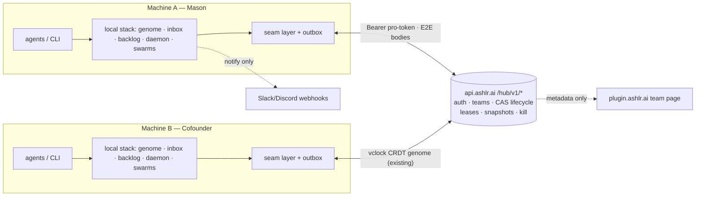

# Ashlr v3 — Team Command Center (end-state spec)

> The v1/v2 end-state specs lived at `~/.ashlr/docs/` — single-founder,
> machine-local. v3 is a **team** spec, so it lives in the repo, travels
> through git, and is reviewed like everything else. This document opens the
> gate that `docs/ROADMAP.md` and `docs/SEAMS.md` deliberately left closed:
> the team / multi-machine backbone.

---

## 1. North Star

**Two founders, N machines, one organization: anything ashlr learns,
proposes, or ships anywhere is visible, reviewable, and applicable
everywhere — proposal-only, local-first, within 60 seconds.**

v1 built the command center. v2 built the autonomous organization and proved
it safe. v2.2 made it agent-native and published it. v3 makes it **plural**:
the same organization, shared by the whole founding team and every agent
working for it — without surrendering an inch of the safety posture that got
us here.

## 2. A Day in the Life (the end state, as scenes)

Every scene below maps to a roadmap row in §7 — no scene ships without a
milestone that delivers it.

- **09:00, machine A.** Mason's agent hits a subtle Vercel edge-runtime
  gotcha, fixes it, and runs `ashlr learn "edge functions can't use
  node:crypto — use Web Crypto" --project ashlrbi`. The entry lands in the
  local hub store and the outbox. *(M35)*
- **09:05, machine B.** The cofounder's agent, mid-task in the same repo,
  runs `ashlr orient` — the recall section surfaces Mason's five-minute-old
  learning. Nobody rediscovers the gotcha, ever. *(M35)*
- **02:30, machine B (overnight).** The daemon holds the lease for
  `ashlrbi`, pulls the shared backlog, and drafts a dependency-security fix
  in a sandbox. A PENDING proposal syncs up — body end-to-end encrypted,
  lifecycle envelope plaintext. Both founders' machines see it; both get the
  opt-in notification. *(M36, M37)*
- **07:40, machine A, over coffee.** Mason opens the localhost dashboard,
  reads the decrypted diff, clicks **Approve**. The decision records
  `decidedBy: mason@…` and syncs. *(M36)*
- **07:43, machine B.** On its next tick, the daemon sees the approval,
  claims the apply (it owns the repo), and `applyProposal` runs locally with
  every M23 gate intact. `appliedBy` records the machine and actor. The
  branch and PR appear on GitHub. *(M37)*
- **17:30, Slack.** The daily digest lands in `#eng`: portfolio health
  deltas, two proposals applied (who approved each), spend vs. team cap,
  one milestone advanced on the v3 goal itself. *(M38, tier-0)*
- **Any time, any browser.** Either founder glances at the team page on
  plugin.ashlr.ai: member presence, activity counts, pending-proposal badge.
  Metadata only — the browser never holds a decryption key, so it can never
  approve a diff it cannot display. *(M40)*

## 3. Operating Principles

The five v1/v2 principles carry forward verbatim (see `docs/ROADMAP.md`):
local-first · proposal-only autonomy · safety by construction, proven by
tests · contracts-first · zero runtime dependencies.

v3 adds five of its own:

6. **Approval may come from anywhere; mutation only from the owner.** Any
   authenticated founder can decide a proposal from any surface that can
   display it. Only a machine with the repo enrolled and present may apply.
7. **Cloud is sync, not dependency.** With zero network, every command
   behaves exactly as v2 does today. Outboxes drain later. Offline costs you
   cross-machine visibility — never local capability.
8. **Every cross-machine hop is one of the eight M30 seams.** No new side
   channels. The seam layer is the complete enumeration of what can leave a
   machine.
9. **The backbone is self-hostable, never public.** Default backend is
   api.ashlr.ai (`/hub/v1/*`); `ASHLR_API_URL` points anywhere, including a
   founders-only instance. Nothing is world-readable.
10. **The server is blind where it can be.** Anything that can contain code,
    diffs, titles, or prose is ciphertext server-side. The server validates
    lifecycle envelopes, never content.

## 4. Architecture Overview

**The load-bearing claim: v3 is the M30 seams growing real second
implementations — nothing else changes shape.** The local stack is untouched;
each activated seam gains a *Synced adapter that wraps the Local adapter*:
the local write happens first and is authoritative for reads; remote sync
flows through a durable append-only outbox (`~/.ashlr/outbox/<seam>.jsonl`)
drained on daemon tick or explicit `ashlr sync`.

New core concepts:

- **`RepoRef` / `repoId`** — `sha256(normalized origin remote URL)`. Local
  absolute paths never cross machines. Enrollment gains a per-machine
  `repoId → localPath` mapping (additive). A repo with no remote gets
  `repoId = sha256('local:' + machineId + path)` — visible in team views,
  never claimable elsewhere, correct by construction.
- **`Actor`** — `{ userId, name?, machineId }` where `machineId` is the
  hashed-hostname scheme the stats sync already uses. Attribution fields are
  optional/additive everywhere (old data parses forever) and write-once.
- **Identity upgrade** — `CloudIdentityProvider` reads `~/.ashlr/pro-token`,
  calls `GET /me`, mirrors the plugin's 24-hour cache / 7-day offline grace.
  The phantom probe remains the fallback: a phantom-only identity can
  *create* proposals but never *approve* them in team mode.

## 5. Seam-by-Seam End State

| Seam | Today (v2.2, local) | v3 end state | Milestone | Endpoint |
|---|---|---|---|---|
| `IdentityProvider` | phantom CLI probe | pro-token bearer → `{userId, name, tier, team, role}`; cache + offline grace | M34 | `GET /me` |
| `GenomeSync` | `~/.ashlr/genome/hub.jsonl` | ONE team memory: existing vclock-CRDT pull/push, X25519-per-member envelope over a shared AES-256-GCM DEK — **reused verbatim from the plugin's production genome sync** | M35 | `GET/POST /genome/:id/pull\|push`, key-envelope |
| `InboxStore` | per-machine JSON files | shared inbox: bodies (title/summary/diff) E2E-encrypted; plaintext lifecycle envelope `{id, repoId, kind, status, timestamps, actors}` so the server CAS-validates transitions; approve from anywhere | M36 | `/hub/v1/inbox/*` |
| `DaemonCoordinator` | always-true local lease | per-`repoId` TTL leases + team spend ledger; offline machine degrades to solo (local caps still bind) | M37 | `/hub/v1/lease/*`, `/hub/v1/spend` |
| `BacklogSource` | local scan + JSON | per-machine latest-wins snapshot docs; team READ aggregation (no merge, ever) | M38 | `/hub/v1/snapshots` |
| `PortfolioSync` | local health reports | same snapshot pattern; dashboard aggregates the team | M38 | `/hub/v1/snapshots` |
| `RunSwarmStore` | local run/swarm files | metadata snapshots only (runs stay local; the team sees activity, not transcripts) | M38 | `/hub/v1/snapshots` |
| `TelemetrySink` | OTLP → `cfg.telemetry.pulse` | unchanged — already team-capable | tier-0 | existing |

Plus one new synced store that rides the existing audit log: **activity** —
`action/result/ts/actor/repoId` plaintext, `summary` encrypted; batch append
up, union down (append-only stores sync trivially). *(M38)*

**Proposal lifecycle (server-linearized CAS):**
`pending → approved | rejected` (first authenticated decision wins; a losing
offline decision becomes an audited no-op) · `approved → claimed` (single
holder, TTL ~10 min) · `claimed → applied | failed` · claim lapse →
`approved`. `rejected` and `applied` are terminal. The server validates
transitions; it cannot read bodies.

## 6. Capability Pillars

1. **Shared Memory** — one genome; `learn` anywhere, `recall`/`orient`
   everywhere; E2E encrypted; append-only.
2. **Shared Inbox & Owner-Apply** — one approval queue; full attribution
   (`createdBy`/`decidedBy`/`appliedBy`); claim-to-apply routing.
3. **Coordinated Daemons** — run the daemon on any machine or all of them;
   per-repo leases prevent double-work; a team spend ledger prevents
   double-budget.
4. **Team Visibility & Digest** — merged activity feed and team aggregates on
   the localhost dashboard; daily Slack digest; metadata page on
   plugin.ashlr.ai.
5. **Team Identity & Trust** — magic-link/GitHub auth, roles, invites, and
   E2E key management reused from the production plugin backend; offboarding
   = DEK rewrap + token revocation.

## 7. Roadmap (M34–M40)

Each milestone is one contracts-first workflow: `CONTRACT-M<N>.md` authored
and reviewed **before** code, adversarial tests alongside, one commit per
milestone, and each ships standalone value. Effort: S ≈ 1–2d · M ≈ 3–5d ·
L ≈ 1–2w. This table mirrors the registered goal's milestones 1:1.

| M | Name | Value shipped | Effort | Server work |
|---|---|---|---|---|
| **M34** | **Foundations** — `ashlr spec import --from <file>` (so this very document becomes a SpecArtifact), `Actor` type + attribution fields (`AuditEntry.actor`, `Proposal.createdBy/decidedBy/appliedBy`, all optional), `CloudIdentityProvider` (pro-token + cache/grace), `machineId`, team activation runbook (`docs/TEAM-ACTIVATION.md`) | every action attributed — useful solo, prerequisite for everything | S–M | `GET /me` (tiny) |
| **M35** | **Team Genome** — `SyncedGenomeSync` over the existing plugin endpoints + DEK envelope crypto; outbox; tick auto-sync; `ashlr genome push\|pull` | **ONE team memory** — first cross-machine value, ~zero server work | M | provision a hub genome id |
| **M36** | **Shared Inbox** — `RepoRef/repoId`, E2E proposal bodies, server CAS lifecycle, approve-anywhere, `'claimed'` status | ONE approval inbox with full attribution | L | `/hub/v1/inbox/*` |
| **M37** | **Apply Routing & Leases** — claim-to-apply, per-repo daemon leases, team spend ledger, opt-in `team.autoApplyOnApproval` (default **off**) | approve-here-apply-there; daemon anywhere without double-spend | L | `/hub/v1/lease\|spend`, claim CAS |
| **M38** | **Team Visibility** — snapshot publishers (backlog/health/daemon/runs), audit/activity sync, localhost dashboard: activity feed, attribution columns, presence, team aggregates | shared backlog/health/goals + who-did-what feed | M | `/hub/v1/snapshots\|audit` |
| **M39** | **Remote Kill & Team Hardening** — team-wide kill (admin-only, polled per tick, **materializes as a local kill write** so it survives offline), DEK rewrap on membership change, adversarial suite over the whole team layer | team-grade safety net; offboarding that actually works | M | `/hub/v1/kill` |
| **M40** | **plugin.ashlr.ai Team Page** — metadata-only activity skeleton, presence, admin controls (kill, invites) | glanceable team status from any browser | M | web-heavy |

## 8. Hard Gates (the loop STOPS and asks the founders)

- Anything that opens a listening port or stores team data off-machine for
  the first time (M35's first sync, M36's inbox).
- Any change to the proposal-apply path (M37 — the highest-stakes milestone).
- Any new runtime dependency (the answer should remain: none).
- Each milestone's contract reviewed before its first line of code.
- Server-side work on api.ashlr.ai is a separate review in that repo —
  hub milestones that need it list it explicitly and block on it.

## 9. Safety Invariants

The entire v2 set carries forward verbatim — proposal-only mutations,
enrollment gating, kill switch, sandboxed swarms, append-only audit, secret
scrubbing, local-first cloud gates. v3 adds thirteen team invariants, each of
which must have a named adversarial test before its milestone closes:

1. **Local-first degradation** — zero network ⇒ exactly v2-solo behavior;
   cloud failure never errors a local flow.
2. **No silent activation** — a synced adapter requires endpoint + valid
   pro-token + team tier; an endpoint without auth refuses loudly (M30 gate
   semantics, now with a real key).
3. **Authenticated approval** — in team mode, approving requires a pro-token
   identity; phantom-only identity can create, never approve.
4. **Owner-only apply** — no machine applies a proposal for a repo it does
   not have enrolled AND present at its mapped path.
5. **Single claim** — at most one apply claim per proposal (server CAS +
   TTL); lapse reverts to `approved`, never to auto-apply.
6. **Monotonic lifecycle** — illegal transitions rejected server-side;
   `rejected`/`applied` terminal; conflicting offline decisions resolve
   first-wins with an audited no-op.
7. **Immutable attribution** — actor fields are write-once; audit is
   append-only on both client and server.
8. **E2E boundary** — code, diffs, titles, work-item text, and genome
   content are ciphertext server-side; membership change triggers DEK
   rewrap; removed members lose future reads and have tokens revoked.
9. **Two-layer kill** — local kill is sovereign (always halts the local
   daemon, network or not); team kill materializes as a local kill write and
   re-asserts on every poll while set. Server-unreachable ≠ killed.
10. **Two-layer budget** — team daily cap via server ledger when online;
    per-machine local caps always bind as the backstop.
11. **Daemon contract unchanged** — still emits only PENDING proposals;
    `autoApplyOnApproval` is explicit opt-in, default off, and founder
    approval is the consent it consumes.
12. **No secrets to the server** — bearer token only; phantom values never
    serialized; scrubbing runs before encryption.
13. **No approval of undisplayable content** — a surface that cannot decrypt
    and render a diff cannot approve it (the web page can therefore never
    approve patch/pr proposals).

## 10. Non-Goals (explicit)

Public SaaS or anything world-readable · plugin marketplace · OS-level
sandboxing · org features beyond a small founding team (roles stay
admin/member) · native mobile apps (the web inbox is responsive instead) ·
syncing run/swarm transcripts (metadata only — transcripts stay local).

## 11. Success Metrics (measurable)

- A learning created on machine A is recallable on machine B in **≤ 60 s**.
- A proposal approved from either machine is applied by the owning machine
  within **one daemon tick**.
- The daily digest reaches Slack with **zero manual steps**.
- **0 new runtime dependencies** at v3 completion.
- Every invariant in §9 maps to a **named adversarial test**; the full
  suite stays green on both founders' machines and CI.

## 12. Verification (per milestone)

House pattern: per-milestone test suites (`test/m34.*.test.ts` …) with the
adversarial lens, plus source-level grep-guards for structural invariants
(the `advance.ts` precedent). Cross-machine behavior is verified hermetically
first (two tmp-HOME "machines" against a local test server), then live
between the founders' actual machines as each milestone's exit criterion.

## 13. Living-Spec Mechanics

- **This document is the source of truth**; changes go through PRs like any
  code. After M34, `ashlr spec import --from docs/SPEC-V3-TEAM.md` makes it
  a first-class SpecArtifact too.
- **The registered goal** (`ashlr goals status`) tracks delivery; its seven
  milestones mirror §7. The loop cycle: `ashlr goals advance` (sandboxed,
  proposal-only) → `ashlr inbox` review → founder decision → repeat. A
  blocked milestone halts the loop until a founder steers.
- **Milestone specs** may be refined with `ashlr spec refine` (mind the 8k
  body cap); this document is refined by PR.
- **Progress surfaces**: `ashlr goals status`, the web dashboard, and — once
  tier-0 is live — the daily Slack digest reporting on the spec's own
  delivery.
- **Cofounder onboarding (today, pre-M35)**: `npm i -g @ashlr/hub`,
  `ashlr init --wire`, paste `ashlr wire --claude-md` into shared repos'
  CLAUDE.md, enroll the repos. Full team activation lands with the M34
  runbook.
