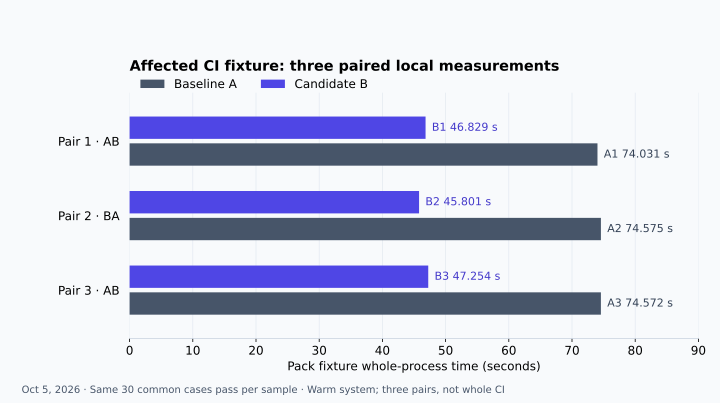

# CI fixture performance

Measured on **October 5, 2026**: three local pairs reduced the affected pack
fixture's whole-process time by a **median paired 27.318 seconds (36.74%)**.
The baseline median was 74.572 seconds and the candidate median was 46.829
seconds. This is a measurement of two affected test fixtures, not the whole CI
pipeline.



The [six-row CSV](fixture-performance.csv) contains the unrounded measurements,
construction and validation command counts, shared case counts and recorded load
snapshots. Rows retain execution order: **A1, B1, B2, A2, A3, B3**.

## Results

A is the baseline; B is the candidate. Construction time covers a batch of 20
fresh Git repositories. Pack time includes the entire owned child process,
including current-source graph setup, test execution and cleanup.

| Sample | Pack process (seconds) | Git construction (ms / 20 repos) | H1 whole process (ms) | Construction Git calls |
| --- | ---: | ---: | ---: | ---: |
| A1 | 74.031 | 674.066 | 2174.738 | 160 |
| B1 | 46.829 | 388.789 | 1532.492 | 60 |
| B2 | 45.801 | 403.664 | 1593.738 | 60 |
| A2 | 74.575 | 664.321 | 1783.447 | 160 |
| A3 | 74.572 | 669.634 | 1795.451 | 160 |
| B3 | 47.254 | 387.839 | 1511.170 | 60 |

| Pair / execution order | Pack saving (seconds) | Pack reduction | Construction saving (ms) | Construction reduction |
| --- | ---: | ---: | ---: | ---: |
| A1 then B1 | 27.202 | 36.74% | 285.277 | 42.32% |
| B2 then A2 | 28.774 | 38.58% | 260.657 | 39.24% |
| A3 then B3 | 27.318 | 36.63% | 281.796 | 42.08% |

For each pair, saving is `A - B`; reduction is `100 × (A - B) / A`.
The reported medians are taken separately over the three paired savings and
three paired percentages. Subtracting side medians or dividing them gives a
different statistic.

Construction used **8 → 3 Git commands per repository (62.5% fewer construction
subprocesses)**: init, add and commit remained real; five separate configuration
commands became one append to Git's ordinary fresh, core-only configuration,
preserving its init-generated bytes. Git 2.49.0 used this fast path. Custom
templates, includes or extensions retain Git's configuration-command semantics
through the helper's fallback. The median paired construction saving was **281.796 ms
per 20 repositories (42.08%)**. Another 140 validation Git calls ran in every
sample and were excluded from construction timing. Whole H1 process time also
includes loading, home setup, validation and cleanup.

## Source comparison

The experiment froze all runtime source at
[baseline c324b14274fe0e1cd584aae4630b5becb1870f9f](https://github.com/ashlrai/ashlr-hub/tree/c324b14274fe0e1cd584aae4630b5becb1870f9f).
The candidate used that same source with **only these five files** from
[donor cff2afb33eea1e4b9895dac0f3c6fa7c19dd8dd2](https://github.com/ashlrai/ashlr-hub/commit/cff2afb33eea1e4b9895dac0f3c6fa7c19dd8dd2):

- [H1 fixture helper](https://github.com/ashlrai/ashlr-hub/blob/cff2afb33eea1e4b9895dac0f3c6fa7c19dd8dd2/test/helpers/h1-fixture.ts)
- [H1 fixture assertions](https://github.com/ashlrai/ashlr-hub/blob/cff2afb33eea1e4b9895dac0f3c6fa7c19dd8dd2/test/h1.fixture.test.ts)
- [Pack/Universe smoke fixture](https://github.com/ashlrai/ashlr-hub/blob/cff2afb33eea1e4b9895dac0f3c6fa7c19dd8dd2/test/local-pack-universe-smoke.test.ts)
- [Sharded test scheduler](https://github.com/ashlrai/ashlr-hub/blob/cff2afb33eea1e4b9895dac0f3c6fa7c19dd8dd2/scripts/test-ci-sharded.mjs)
- [Scheduler assertions](https://github.com/ashlrai/ashlr-hub/blob/cff2afb33eea1e4b9895dac0f3c6fa7c19dd8dd2/test/test-ci-sharded.test.ts)

Both snapshots contained 4,920 members, with bytes and modes checked before and
after observation. These five files are byte-identical in
[ec8a96296e18f65a5a2700b9733705aebb9e15c5](https://github.com/ashlrai/ashlr-hub/commit/ec8a96296e18f65a5a2700b9733705aebb9e15c5)
and
[79fd9ec1206efc273ce2a529cf3fdd6ab1495a69](https://github.com/ashlrai/ashlr-hub/commit/79fd9ec1206efc273ce2a529cf3fdd6ab1495a69).
The other changes in those later commits were **not** part of this experiment.
Scheduler phase defaults improve reliability and visibility; their speed was
not measured.

## Method and correctness

The pinned tools were Node **22.22.3**, Git **2.49.0**, Vitest
**4.1.11**, esbuild **0.28.1**, tsx **4.23.13** and TypeScript **5.9.3**. Both
source snapshots used the same physical dependency installation. The observer
started fresh processes with priority `nice 19`, private HOME and temporary
directories, and a credential-free environment. The historical observation
receipt does not pin the operating system, architecture or CPU model.

To repeat the comparison, reconstruct A from the exact baseline and B from that
baseline plus the five donor files above, then record your own tool versions,
cache conditions and system load. Installing dependencies separately changes
the conditions from this observation. The observation driver was private; the
public source and protocol below describe the comparison, rather than providing
a one-command replica of the original capture.

1. Run three pairs in AB, BA, AB order, without warmups or retries.
2. For each H1 sample, use `makeFixture()` to construct 20 real repositories,
   seeded with `README.md` containing `# paired benchmark\n` and
   `src/lines.ts` containing `export const value = "π";\n`.
   Time `makeRepo()` separately from HOME setup, validation and cleanup.
   Count actual Git subprocess calls separately for construction and validation.
3. Verify persisted author/configuration, a clean worktree, committed UTF-8
   content and LF checkout behavior, then compare Git trees. All **120** trees
   here matched `7065f1183e20247a38d1c1142d1ebcd7dffd4f95`.
4. Run the pack fixture through the source-backed wrapper below with one worker,
   no file parallelism and no Vitest result cache. Time child creation through
   confirmed close, including source graph compilation and cleanup.
5. Match the exact shared case-name set and confirm owned temporary paths are
   absent after process settlement. All **30 common cases per sample** passed;
   all 12 H1/pack children exited zero and owned cleanup was confirmed.

From each reconstructed snapshot, the pack child used the following invocation.
`REPORT.json` is a fresh output path in that sample's private temporary directory;
this command runs local tests and writes the report.

```sh
node scripts/test-ci.mjs test/local-pack-universe-smoke.test.ts \
  --maxWorkers=1 --no-file-parallelism --no-cache \
  '--testNamePattern=^(?!.*matches the direct TypeScript SDK and successful real CLI observations).*$' \
  --reporter=json --outputFile=REPORT.json
```

The filter excludes only the **candidate-added direct TypeScript/real CLI parity
case from timing**. It was already qualified in ordinary testing and remains in
the regular suite. The candidate reporter therefore recorded exactly one skipped
row; no common case was skipped or failed. This timing filter does not remove
ordinary release checks or create a dispatch gate.

## Limits and retained failures

The system was warm. OS page cache, shared dependency/Vite caches and background
load were uncontrolled and were not purged. `--no-cache` disables Vitest's result
cache; it does not make this a cold-cache experiment. Load snapshots are retained
in the CSV; **B1's before/after load readings are unknown**.

The original observer exited unsuccessfully after A1/B1 because its parser
predicted `pending` for the filtered parity row, while Vitest reported `skipped`.
The actual children and their 30 common cases succeeded. Their original raw
records were retained; B1's sample summary was reconstructed from those records.
A corrected continuation ran only B2/A2/A3/B3 and succeeded, without repeating the
first pair. A separate continuation preflight failed on a receipt mode-field
assumption before launching children; that failure was also retained.

Pack timing includes graph discovery/transpilation and surrounding setup.
Reporter-init-to-first-case envelopes were 233–419 ms; polled candidate
mirror-observation-to-first-case envelopes were 144–169 ms with 50 ms sampling.
Neither isolates graph compilation cost.

Three local pairs support this affected-fixture observation. They do not establish
a 95–99% reduction in CI time, whole-pipeline performance, cold-cache performance,
a statistically general result, or live provider/production performance.
